# OpenGD77 User Guide 
(19th November 2019)

## Introduction

This user guide is a work in progress as is the Open GD77 firmware. If you find any errors or omissions please let me know so they can be corrected. 

This manual covers both the original Tier 1 / Phase one version, which includes Hotspot mode, as well as the Tier 2 Alpha versions which don’t include Hotspot mode, but to have other new features.

Due to the rapid pace of development some of photos of screens are now out of date, because the DMR TS and CC are now down shown on all DMR screens.

The photos will be updated when the firmware is not changing so quickly

The intention of the OpenGD77 project is to create a fully featured non-commercial firmware that entirely replaces the Radioddity GD-77’s factory firmware. This firmware is specifically designed for **Amateur Radio** use, and has features not available in the official firmware.

**Note.**
**The firmware is still under development and there are some key areas of functionality which have yet to be written.**

1. Currently the stable firmware only works on DMR with simplex hotspots or to other DMR radios for simplex contacts. This is because the firmware currently does not fully support DMR Tier 2 required for most commercial and MMDVM repeater systems.

   However DMR mode can be used with a simplex hotspot and for DMR simplex operation.

   There is pre-release (Alpha 2) version which supports Tier2 , repeater and duplex hotspot operation, but it currently has some minor issues.

   *Note. The Tier 2 version does not currently support Hotspot mode*

1. FM Rx and Tx transmission works.

   This includes repeater operation using CTCSS on both Tx and Rx.

1. On DMR, only Talk Group “calls” and Private calls are currently possible

   Text messaging and other similar features are currently not supported, but are on the To Do list.

   For a full list of current bugs, and proposed enhancements see  
   https://github.com/rogerclarkmelbourne/opengd77/issues

The firmware is designed for Amateur Radio use, especially on DMR, and has a number of features for Amateur Radio use which are not normally available on commercial DMR radios.

These include direct numerical entry of DMR TalkGroup numbers and use of the Rx Group list to control the TG’s selectable for each DMR “channel”

Also, as far as possible the firmware is open source. This allows anyone to modify the firmware to suit their own individual needs, and also for peer review and improvement of the firmware source code

#### Credits:

The project was conceived by Kai DG4KLU, who developed the initial framework and all the FM and DMR Tx and Rx (Tier 1) functionality.

Kai ceased actively participating in the project in June 2019 and at the time of writing Roger VK3KYY is the main and only developer.

The Tier 2 functionality, User Interface, Display driver, Codeplug API, EEPROM memory API, Flash memory API, Hotspot mode and many other features were developed by Roger VK3KYY

Multiple bug fixes and additions from Alex DL4LEX, including the Lock Screen and DTMF and Tone burst functions

Graphical and other enhancements from Daniel F1RMB

Additions from Colin G4EML, including FM CTCSS and “All Channels” zone functionality

This user guide was written by Roger VK3KYY based on work by Alister G0NEF

Thanks to all the Beta Testers that provide detailed bug reports and user feedback, especially VK7ZCR, W1RHS and G4TSN

#### Download links and other resources

**Firmware source code and binaries:**

Stable version: (Tier 1 + Hotspot mode)  
https://github.com/rogerclarkmelbourne/OpenGD77/raw/master/firmware_binaries/OpenGD77.sgl

Tier 2 “Alpha 2”version (Does not include Hotspot mode)  
https://github.com/rogerclarkmelbourne/OpenGD77/raw/Tier2/firmware_binaries/daily_builds/OpenGD77_Tier2_Alpha_2.sgl

**GD-77 Community CPS with support for OpenGD77:**  
https://github.com/rogerclarkmelbourne/radioddity_gd-77_cps/raw/master/installer/RadioddityGD77CPS31XCommunityEditionInstaller.exe

## Installation

The firmware can be installed onto the GD-77 using the firmware update tool provided by Radioddity with their official firmware update packages. This can be downloaded from Radioddity’s website [radioddity.com](https://radioddity.com/) . See Radioddity’s documentation on how to use their firmware update tool.

The newer versions of the Community CPS also have a feature in the Extras menu to upload the firmware into the radio.

The OpenGD77 firmware (.sgl file) can be downloaded from Github, using either of the links as listed in section 1.1 of this guide.

Installation of the OpenGD77 firmware is undertaken at the owners own risk, but the official firmware can usually be reloaded onto the GD-77 if the user has problems with the OpenGD77 firmware.

Note. The official Radioddity GD-77 CPS PC software is not compatible with the OpenGD77 firmware, and the “Community CPS” should be used instead. This can be downloaded from the link show in section 1.1 of this guide

## Main screens (VFO and Channel screens)

The OpenGD77 firmware has 2 main screens.  The VFO screen and the Channel screen. These are similar to the channel and VFO screens in the official firmware, except have additional functionality.

Initially after the OpenGD77 firmware is installed, the VFO screen will be displayed.

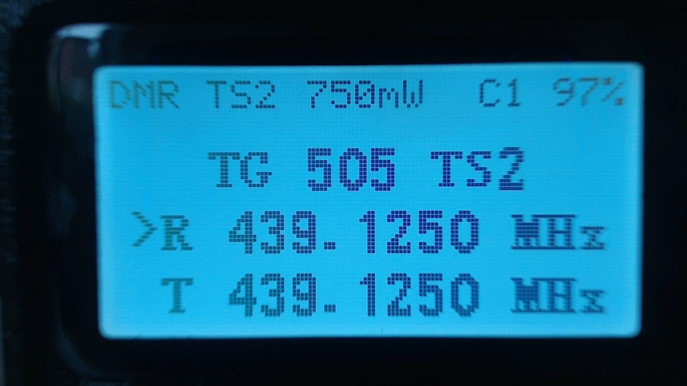

The frequency used in the VFO for both Tx and Rx will be read from the “VFO A” settings of the codeplug.

On both the VFO and Channel screens, the mode (DMR or FM) is shown in the top left of the display, and the battery voltage percentage is shown in the top right of the display

In DMR mode the current TimeSlot is shown to the right of the “DMR” text e.g TimeSlot 2 “TS2
, and the Colour Code e.g. “C1” is shown to the left of the battery percentage.

The current Tx power is shown in the middle of the top of the screen. E.g. 750mW 

On the VFO screen, the Tx and Rx frequency are shown, as well as the TalkGroup when in DMR mode.

The arrow to the left of the R (receive frequency) indicates that the keypad up and down arrows and number entry keys will control the Rx frequency.

The channel screen displays the same information in the top row, but displays the Channel name (in this example “VK3RGL D”) as well as the Zone (“VK3 DMR”) and in DMR mode the TalkGroup will also be displayed

On both the VFO and Channel screens:

Press the **Red** menu button to toggle between the VFO and Channel screens

Press the **Green** menu key to enter the menu system

Pressing **Function + Green** gives quick access to the Channel details screen, which can also be accessed via the menu system. 
*Note.*
The VFO is actually a special type of channel; hence the Channel Details screen also works for the VFO.

#### Changing from VFO < -- > Channel

Press the **Function + Star (*)** key to toggle between FM and DMR mode on either the VFO or Channel screens.

#### Changing Timeslot in DMR mode
In DMR mode, pressing the **Star (*)** key toggled between Timeslot 1 and Timeslot 2

#### Controlling Tx power

Press **Function + Right** to increase the power, Press **Function + Left** to decrease the power. Power can be set to 250mW, 500mW, 750mW, 1W, 2W, 3W, 4W and 5W.  
Note. The power output will only be correct after the operator has calibrated their own radio, as the GD-77 does not seem to have very accurate power calibration applied in the factory by TYT

#### Signal strength bar graph

In both FM and DMR mode, the signal strength of the received signal is show as a bar graph across with width of the screen. 100% bar graph is approximately S9 +40 dB.

In DMR mode the signal meter will only be active when the DMR hardware detects a DMR signal.

In FM mode the signal meter should operate all the time.

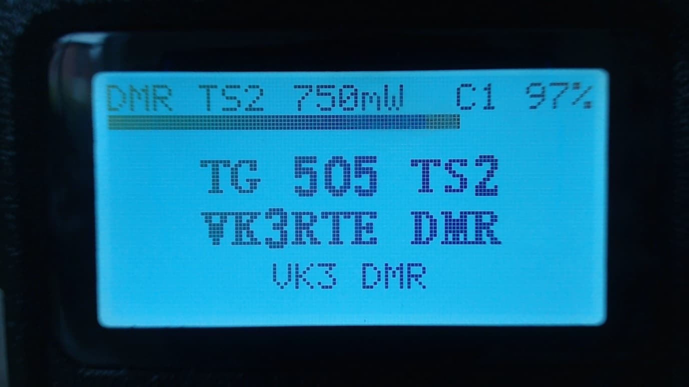

### Channel screen specific functionality
The Channel screen displays the current Channel number as well as the current zone. 

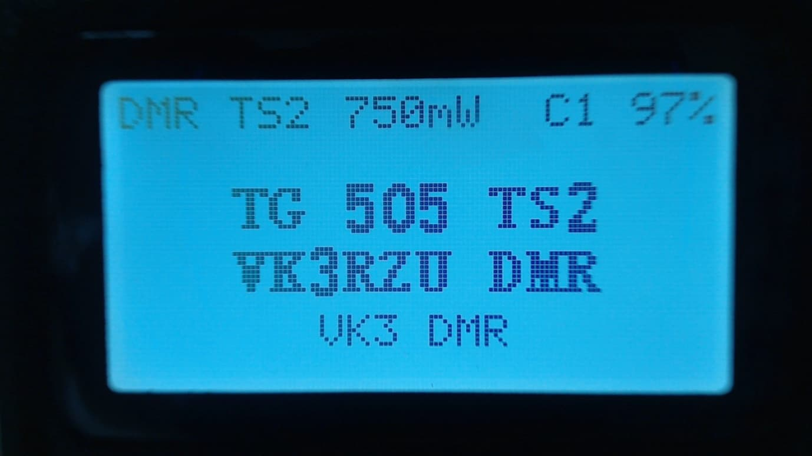

#### Changing channels within the current zone

Pressing the **Up** or **Down arrow** keys changes channel in current zone, and the channel number in the zone will be displayed in place of the zone name.

#### Changing zones

Pressing **Function + Up arrow** or **Function + Left arrow** changes to the next or previous zone

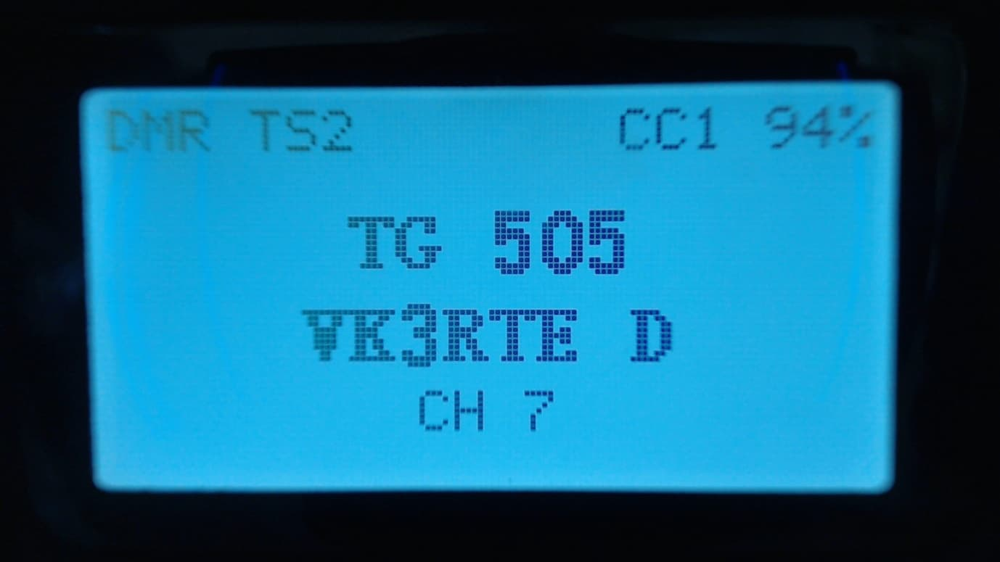

#### Channel screen Quick menu

Pressing the **Orange** button on the top of the radio in Channel mode displays the Quick menu for the Channel screen.

##### Copying a channel to VFO

##### Read the VFO into the current channel

Press the **Green** key to confirm and save the updated channel to the codeplug memory **Red** key to cancel.

#### VFO Quick menu

Pressing the **Orange** button on the top of the radio in VFO mode displays the Quick menu for the VFO screen. Currently this has three options

##### Copy Tx frequency to the Rx frequency

##### Exchange the Tx and Rx frequencies

##### Copy the Rx frequency to the Tx frequency

Press the **Green** key to confirm the copy or **Red** key to cancel. 

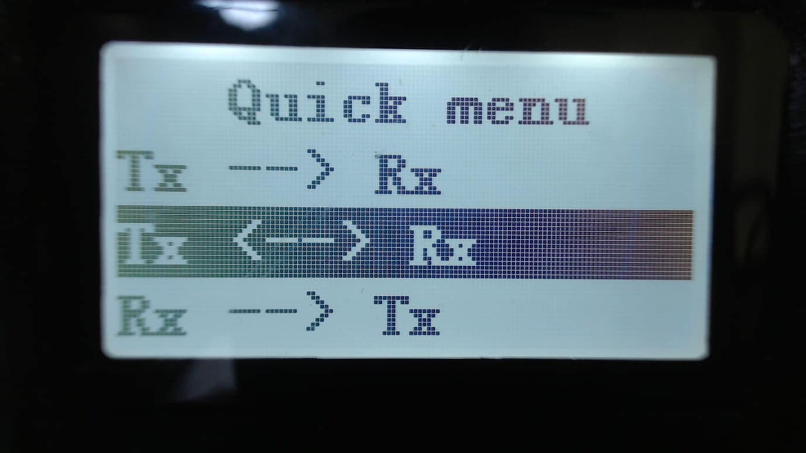

**Note.**

Listening to the input of a repeater will only work in DMR mode if both the Tx frequency and the Rx frequency are the same. This is because most DMR radios do not give an option to select Tier2 Active or Tier 2 Passive mode, and instead assume that if the Tx and Rx frequencies are the same the radio needs to be in Active mode, where the radio is the DMR master. Whereas if the Tx and Rx frequencies are the same the radio assumes it needs to operate in Tier 2 Passive mode, where the repeater signal controls the DMR timeslot synchronization.

However to listen on the input of a repeater, the signal that is received does not contain the synchronisation information hence the radio needs to be put into DMR Active mode in order to receive the signal.

I am not sure whether the official firmware is able to receive on the input of a repeater if a channel was setup with the Tx and Rx frequencies swapped, but because of the way the OpenGD77 firmware actually monitors both TimeSlots simultaneously, but only decodes the TG/ID and audio for the selected TS.

### DMR specific functionality (VFO and Channel screens)

#### Timeslot selection

The **Star (*)** key toggles between Timeslot 1 and Timeslot 2 (Tier 2 version)

Note. The Timeslot number is not shown in this photo but appears to the right of the “DMR”, also the Colour Code is show to the left of the battery percentage

#### DMR ID callsign and name display

When a DMR signal is received which uses the same Colour Code as selected for the VFO or Channel, the radio display will show the station’s Talkgroup and DMR ID

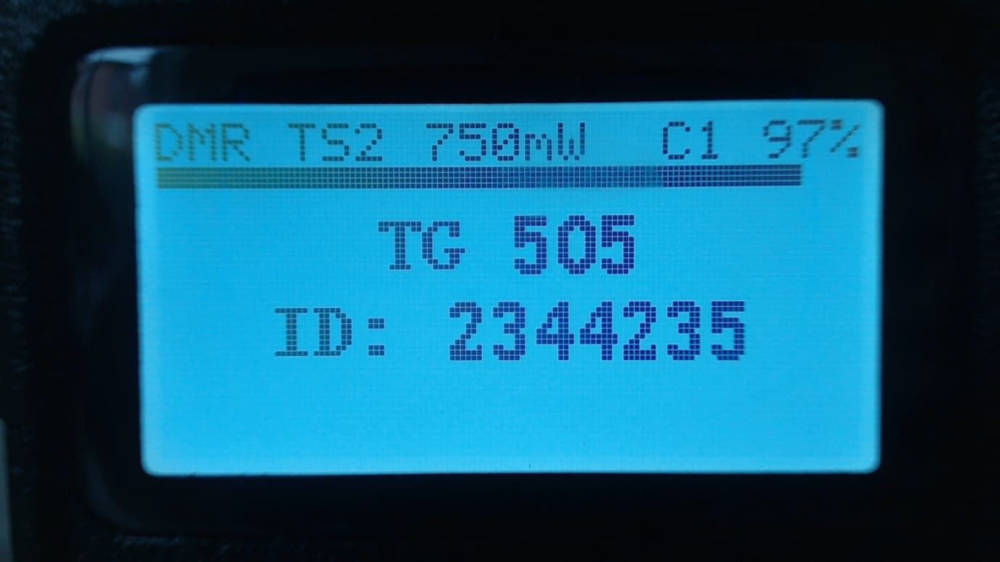

If the DMR ID is in the DMR ID database previously loaded into the radio, the callsign and name will be displayed.

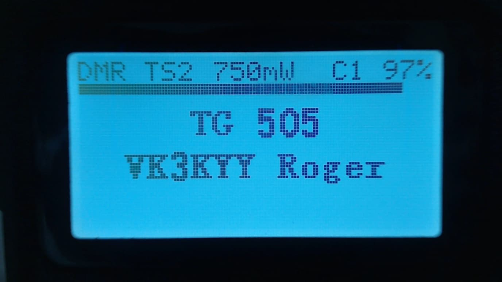

#### Talker Alias display

On the Brandmeister network, if the station’s DMR ID is not in the DMR ID database, the display will show the Talker Alias information sent by Brandmeister.

The callsign will be displayed in the centre of the screen, and additional information will be displayed at the bottom of the screen. The additional information will default to the text “DMR ID:” followed by the stations DMR ID number.

If the station has entered any data into the APRS section of their Brandmeister “Self care” page, that text will be display in place of the DMR ID number.

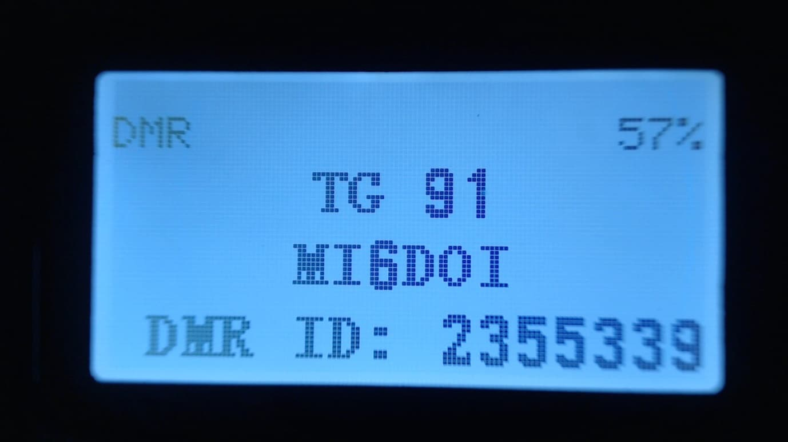

Note. As the Talker Alias data is sent slowly as it is embedded inside the DMR audio data frames, the callsign will appear first and about half a second later the DMR ID or other text will arrive via the DMR data and be displayed.

#### Talkgroup selection from the Rx Group list

Press the **Left** or **Right Arrow** keys to cycle through the TalkGroups in the RxGroup assigned to the VFO or Channel in the CPS. 
This TalkGroup will apply to both Rx and Tx.

#### Assignment of Timeslot to Digital Contact TalkGroup

A new feature introduced to the Community CPS allows a TimeSlot to be applied to each Digital Contact TalkGroup

By default, the Channel TS override is disabled. This means that if the **Left** or **Right** arrows are pressed to select this TG within the Rx Group list, the Timeslot assigned to the Channel (in the CPS) or manually changed using the **Star** key will not change

However if the Digital Contact has an override TS assigned. E.g. TS 1. 
When this Digital Contact TG is selected by pressing the Right or Left arrows, the Timeslot will be set to the Timeslot assigned to the Digital Contact TG

#### TalkGroup displayed in inverse video

If a Talkgroup is displayed in inverse video during reception of a DMR signal, this indicates that the current Tx TalkGroup does not match the received TalkGroup, hence pressing the PTT would not transmit back to the station on the same TalkGroup.

If you want to transmit on the same TalkGroup as the currently received signal, press the **Function** (blue) button on the side of the radio while the TalkGroup is being displayed in inverse video and Tx TalkGroup will be set to the Rx TalkGroup

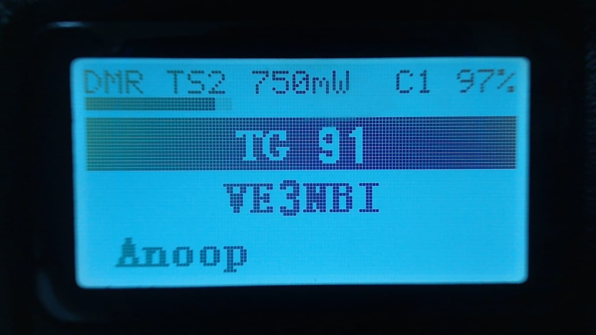

#### Manual TalkGroup number entry

Press the **Hash (#)** button to enter the TalkGroup number. Followed by the **Green** key to confirm

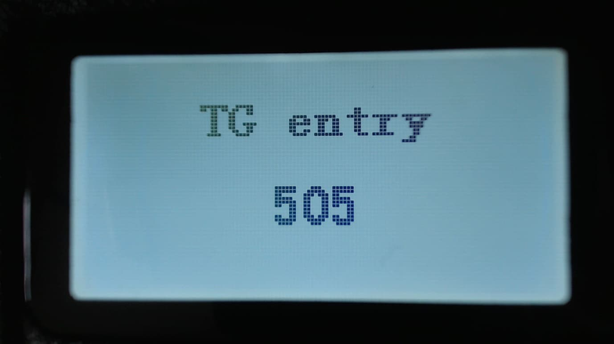

#### Private Call number entry

Press the **Hash (#)** again to enter a Private Call DMR ID number. 

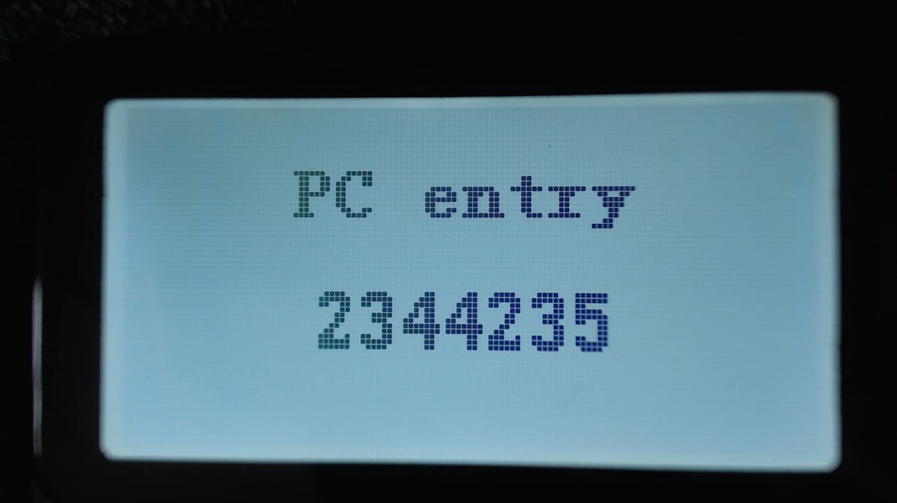

In all numeric entry screens, pressing the Red menu key exits back to the previous screen, either the VFO or Channel screen

#### Digital Contact selection

Press the **Hash (#)** again to access the Digital contacts defined in the CPS

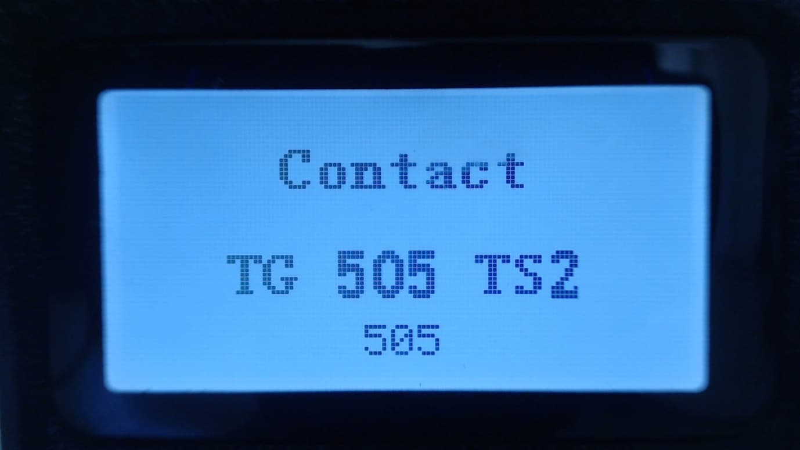

The contact name is show in the middle of the screen, e.g. “TG 505 TS2” and the TalkGroup or PC number is shown in smaller text at the bottom of the screen

Press the **Up** or **Down** arrows to cycle through the list of Digital Contacts

Press **Green** to select or **Red** to cancel.

Private calls can also be selected. 

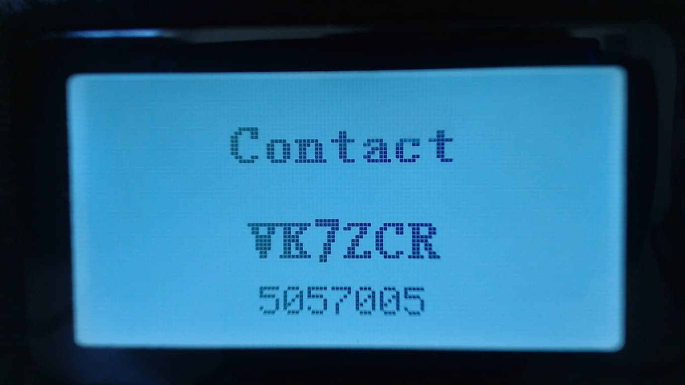

#### Station DMR ID number entry

In Contact selection mode, press **Function + Hash (#)** key, and an alternative DMR ID can be entered, for test purposes, to temporarily override your normal DMR ID number which was loaded from the codeplug.

This DMR ID will be used for transmission *until* the radio is rebooted or you enter another DMR ID via the same screen.

To make the change permanent, so that its written back to the codeplug Press **Function + Green** instead of **Green** to enter the number.

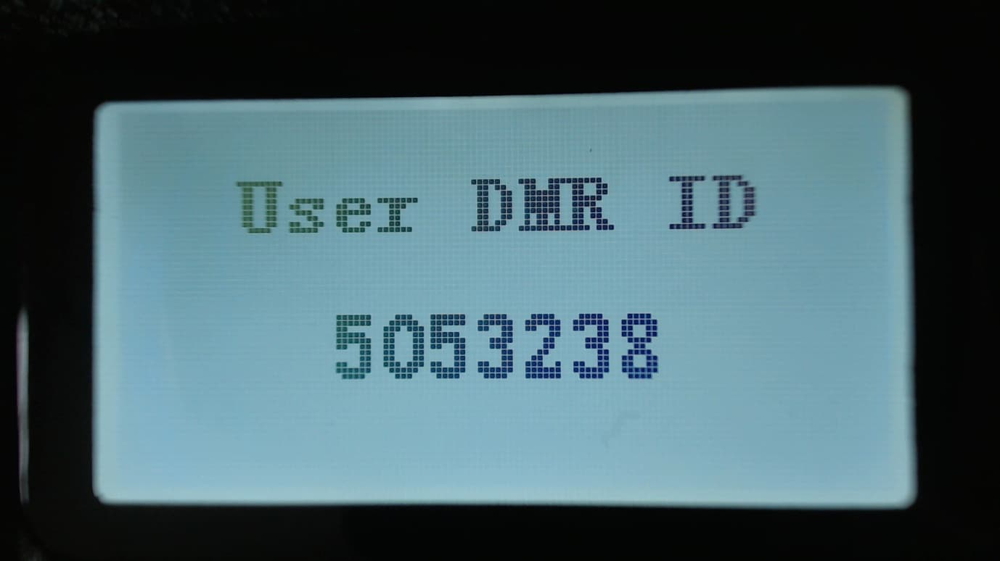

### FM specific functionality (VFO and Channel screens)

#### FM / FM Narrow

**For FM with 25kHz band with the text “FM” is displayed in the top left of the screen.
For narrow band / 12.5kHz the text “FMN” is displayed**

#### CTCSS tone

This can be set for the Channel or VFO, the letters **CT** **CR** or **CTR** will be displayed next to the FM indication at the top of the screen.

**CT** means CTCSS Tx tone only. **CR** means CTCSS Rx tone only. **CTR** means CTCSS Tx and Rx tones.

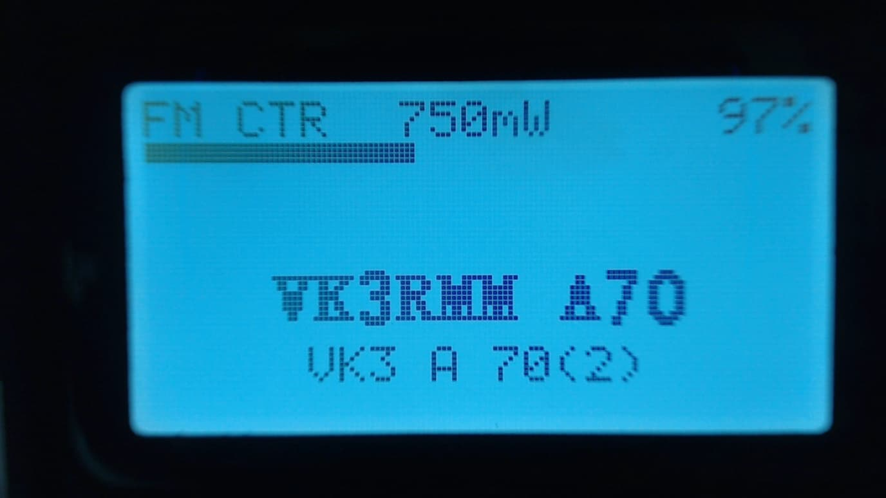

#### Squelch

Pressing **Left** or **Right** keys, activates the FM squelch control

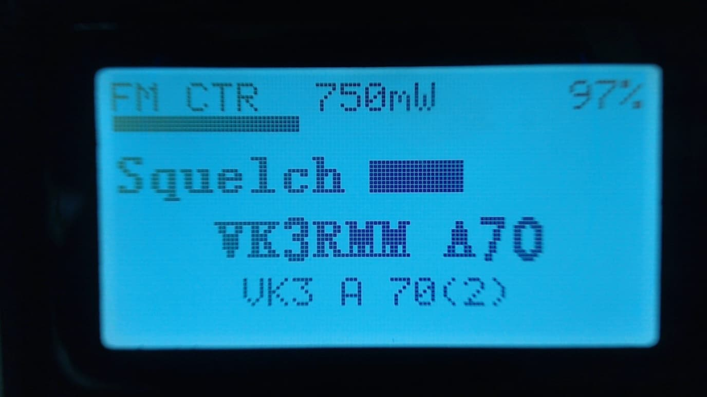

Once in squelch control mode, pressing **Right** the squelch more, **Left** opens the squelch more.

The VFO and each channel have individual squelch settings

The variable squelch can be set to different values for each Channel and for the VFO using a new feature in the Community CPS, where the squelch can be set anywhere between Open and Closed in 5% steps.

In this example the squelch in the VFO is set to 20%

If the squelch is changed in the VFO the value will be remembered even if the radio is power cycled. However if the squelch on a channel is changed, the value is only a temporary override. 

To make the squelch change permanent to a Channel, press **Function + Green** to enter the Channel Details screen, and then press **Green** again to save the channel data to the codeplug.

Note.  
If Rx CTCSS is enabled, this has priority over the squelch control, and lowering the squelch threshold will not cause the squelch to be opened.

#### 1750Hz Tone for repeater operation

Pressing the **Function** button during FM transmission, sends the 1750Hz tone required for some repeater operation.

#### DTMF tone transmission

Pressing any key on the keypad except the Green and Red menu keys will transmit the DTMF tones for that key.

The tone will also be audible through the speaker.

### VFO specific functionality

The VFO displays both the Tx and Rx frequency at all times.

When the currently selected frequency is the **Rx** frequency, an arrow is displayed to the left of the “**R**”, changes to the frequency will adjust both the Tx and Rx frequencies.

#### Frequency change up/down step

Pressing the **Up** or **Down arrows**, will change frequency by the value defined in the frequency Step value defined for the VFO in the CPS.

The step can be adjusted by pressing **Function + Green** to enter the Channel Details mode, and then adjusting the “Step” setting

#### Numerical frequency entry

Pressing any of the number keys allows the direct entry of the frequency.

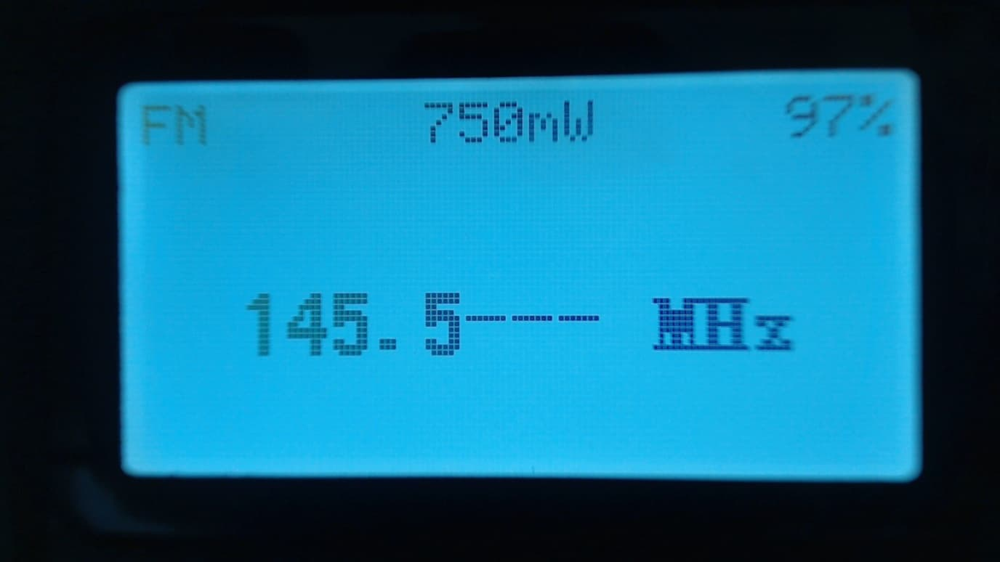

When all digits have been entered, the accept beep tones are played, and the display returns to the VFO screen. 

If an invalid frequency is entered the error beep tones are played.

When entering a frequency:

Pressing the **Red** key cancels the entry

Pressing **Left Arrow** deletes the digits one by one.

#### To adjust the Tx frequency, independent of the Rx frequency. 

Press the **Function (Blue)** button on the side of the radio, and the **Down arrow**. 

This will change the currently selected frequency to the Tx frequency, and the arrow will move to the left of the “**T**” instead of the “**R**”

To change the Rx frequency again, press **Function + Up arrow**.

When the Tx frequency is changed, the Rx frequency will not be changed.

Use this method to set different Tx and Rx frequencies e.g. this can be useful for satellite operation as it allows Cross Band operation as well as split frequency simplex operation on the same band.

**Note**

If different Tx and Rx frequencies are set, and the currently selected input is set to Rx. Changing the Rx frequency will also change the Tx frequency, and the difference between the Rx and Tx frequency will be maintained if possible.

The only case where the frequency difference will not be maintained is if the Tx frequency goes outside of the range of frequencies supported by the radio hardware.

## Transmitting

During transmission the Talk Timer, either counts up or down depending on whether the channel has a timeout defined.

If a timeout is defined in the CPS, or adjusted in the Channel Details screen, the Talk Timer will count down and when the timeout period is reached a beep will play and the Tx will stop.

In DMR Tier2 the timer will not start counting until the repeater becomes active.

During DMR Tx a VU meter is displayed showing the input microphone level, in the form of a bar graph across the top of the screen.

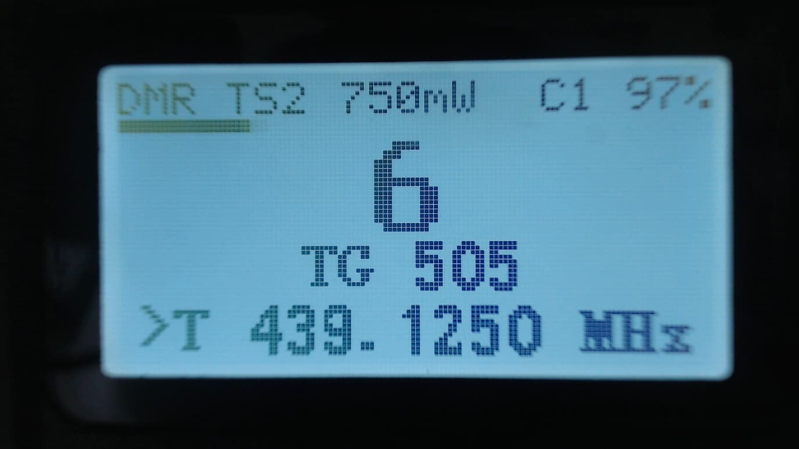

##### Timeout warning beep

A timeout warning can be configured in the Utilities menu. The radio will beep every 5 seconds when the remaining call time is less than the Timeout warning time that you have configured in the Options screen

##### TOT

If TOT is setup for the current channel or VFO, when the timer counts down to zero the transmission will stop, a warning beep will be played and the radio will stop transmitting

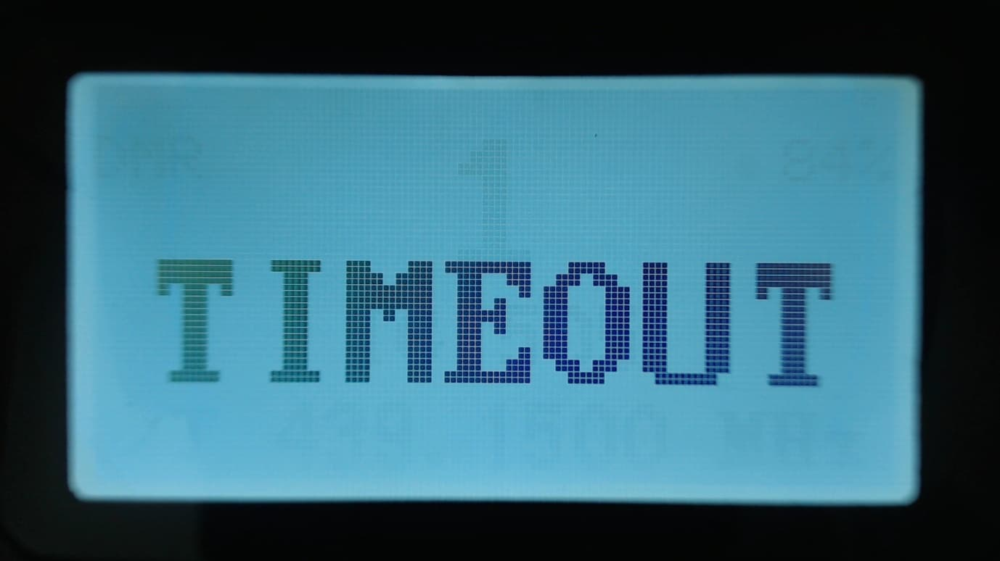

## Other screens

#### Lock screen

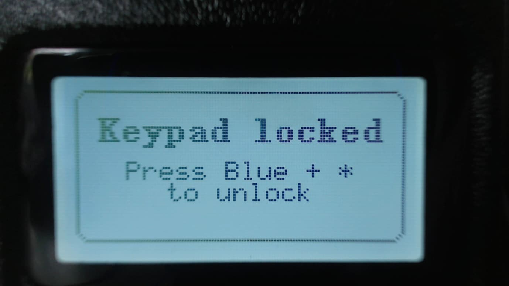

To the lock the keypad.

On either the VFO or the Channel screen, press the **Green** menu key to display the Main menu, then press the **Star (*)** key

To unlock the keypad

Press and hold the **Function (Blue)** button and press the **Star (*)** key

## The control keys and buttons

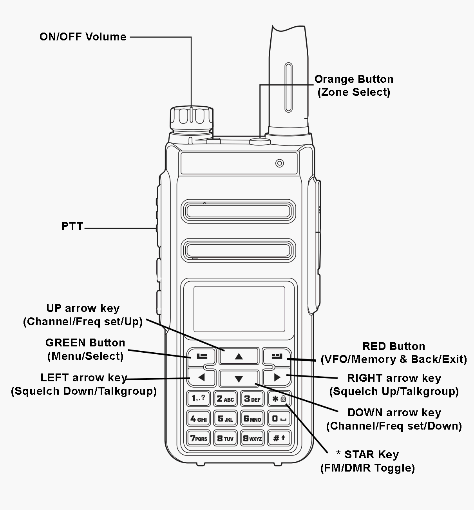

## The Menu System

Pressing the **GREEN** key enters the menu system, press again to enter a menu subsection or to exit the menu.

Press the **RED** key to step back one level or to exit the menu system.

The **UP** and **DOWN** arrow keys step up and down through the various pages of the menu system.

The **LEFT** and **RIGHT** arrow keys will change the individual items in the menu system where they are changeable.

The **BLUE** button on the side of the radio, known as SK2, is used as a “**Function**”. Various features are accessed by holding the “function” key when pressing a button on the keypad.

## Main Menu

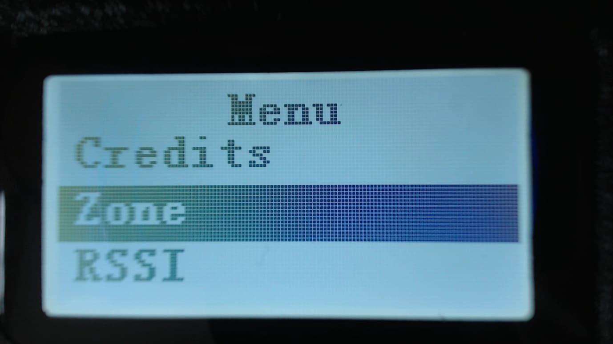

### Zone

This menu is used to select which groups of channels, called a Zone, is used in the Channel screen, and operates in the same way as the official Radioddity firmware, except with one addition.

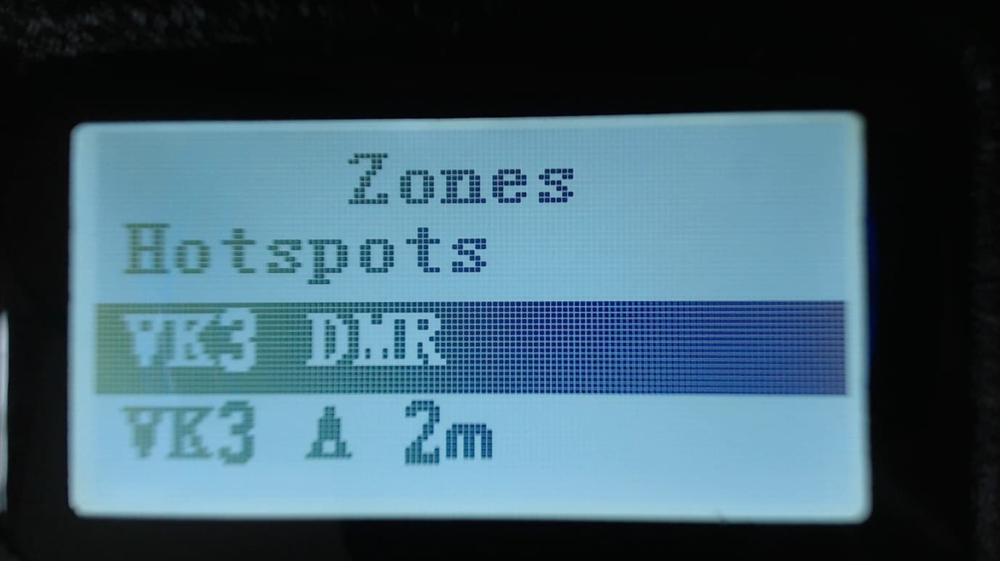

In addition to the Zones that are defined in the CPS and uploaded to the GD-77 using the Community CPS. The firmware creates a special Zone called all Channels

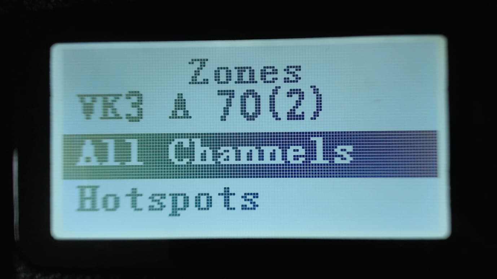

When the All Channels zone is selected, the Channel screen displays the channel number instead of the zone name e.g. CH 1

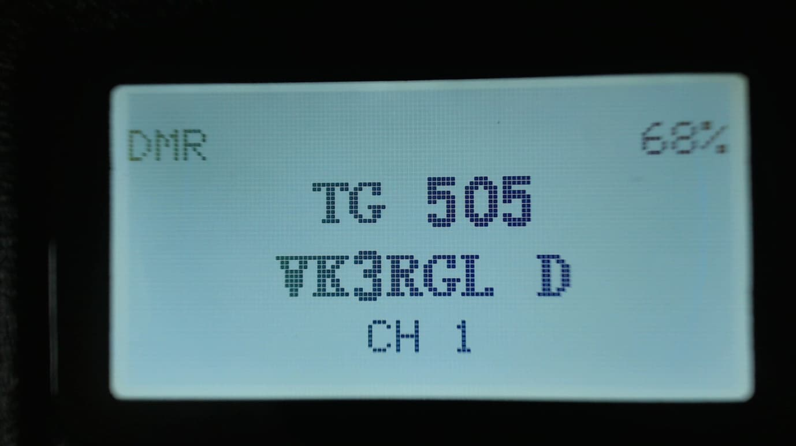

Pressing the **Up** and **Down** arrows will cycle though all channels in all zones

Pressing any of the number keys on the keypad, enters   ‘Goto channel number mode’

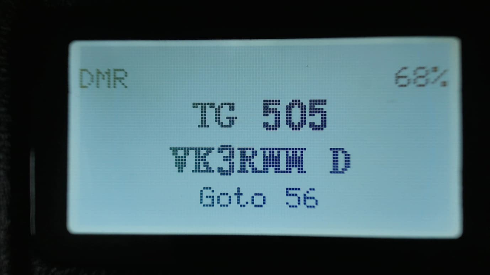

In this mode, you can enter multiple digits and then press the Green key to confirm, or the Red key to go cancel.

### RSSI

Displays a signal strength indicator showing the numerical RSSI value in dBm, along with an S-Unit bar graph.

*Notes*

Both RSSI and S meter are not calibrated and will vary somewhat between different radios in their accuracy

DMR signals by their nature, because they are pulse transmissions will not give accurate RSSI values.

The number in the top right of the display is for debugging purposes and is the number reported by the receiver hardware.

### Battery

Displays the current battery voltage.

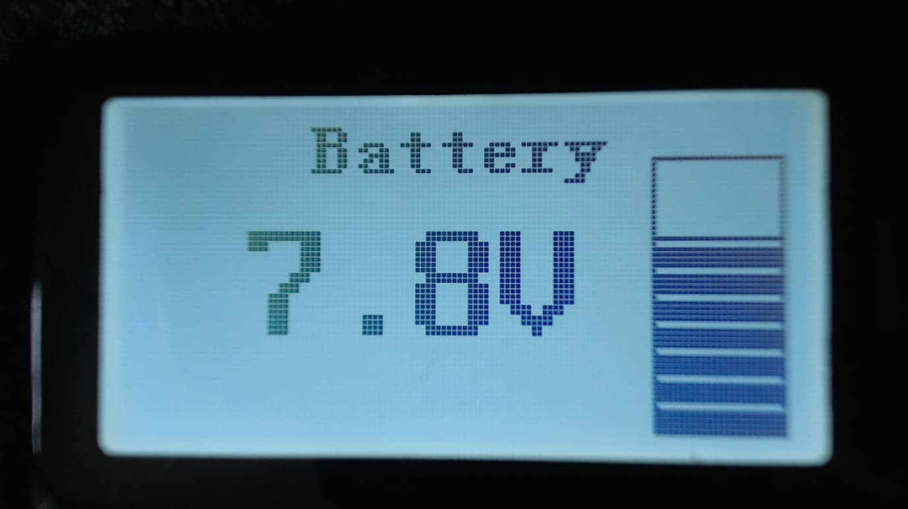

### Last Heard

Displays a record of the last 16 DMR stations that the radio has received.

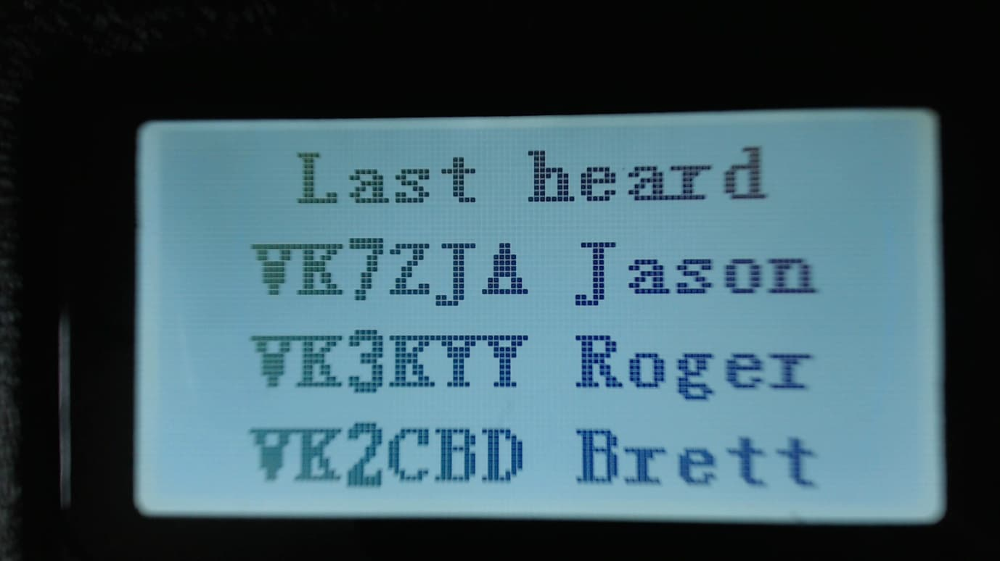

Pressing the **Up** or **Down** arrows cycles through the list to show stations which have been heard.

The radio stores data on the last 16 stations that were heard 

### Firmware Info

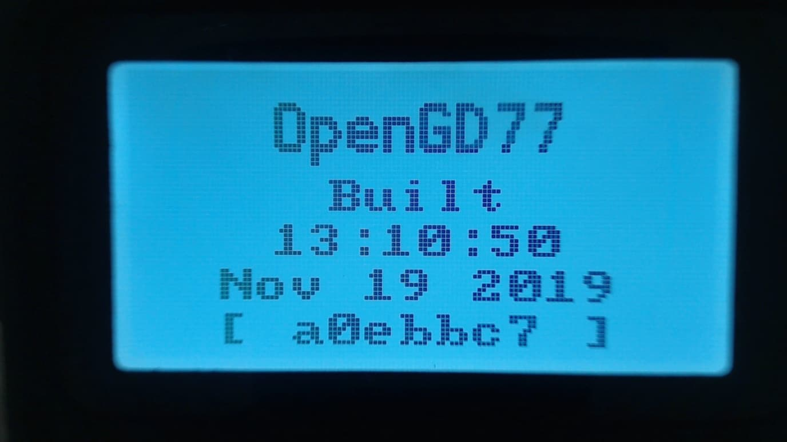

Displays the date and time the firmware was built, and also the Github commit code in brackets. 

To view details on Github, append the code to  
https://github.com/rogerclarkmelbourne/OpenGD77/commit/

e.g.  
https://github.com/rogerclarkmelbourne/OpenGD77/commit/a0ebbc7

### Options

The **Options** screen is the new name for the **Utilities** menu.

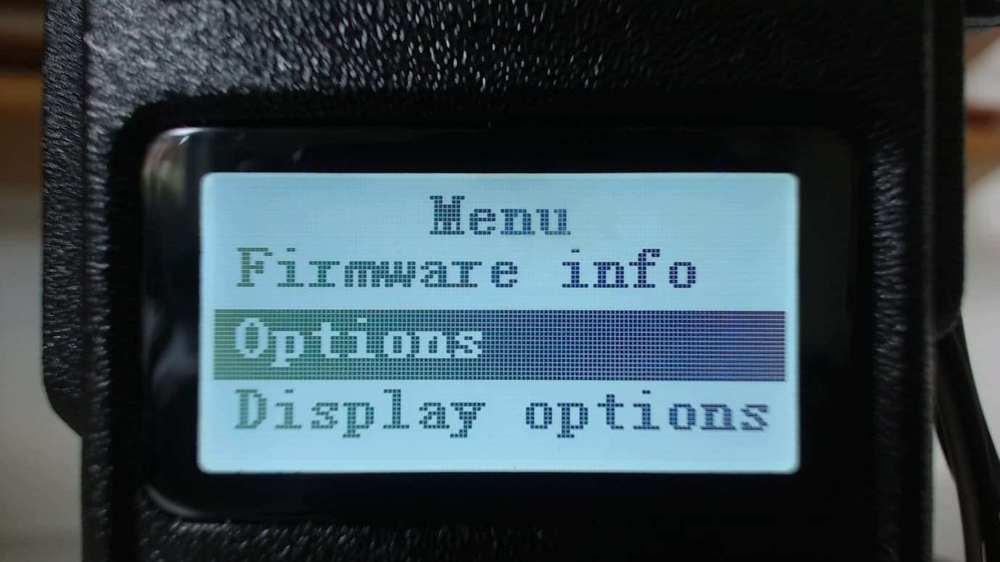

This menu controls various settings specific to the OpenGD77 firmware

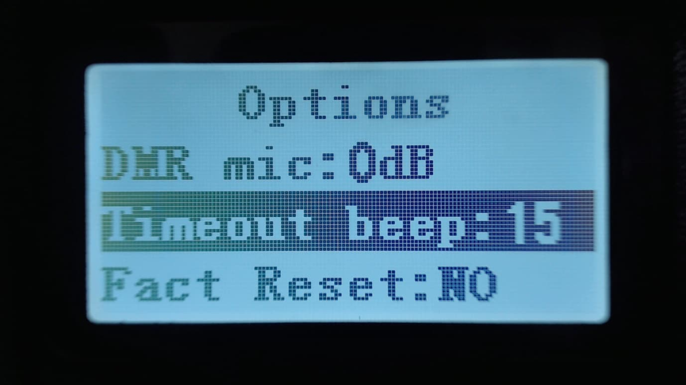

#### DMR mic

This controls the audio gain of the DMR microphone input system, relative to the default value. 

This only adjusts the gain on DMR, and does not affect the FM mic gain.
Settings are in 3dB steps, with 0dB being the normal default setting, which is the same as the official firmware.

#### Beep volume

This controls the volume of the beep and other tones, and can be set from 100% to 10%

#### Timeout beep

This setting controls whether the radio emits timeout warning beeps during transmission when the timeout is about to expire and transmission will be terminated.

#### Fact Reset

Resets the radio to default settings, and reads the CPS VFO A values from the codeplug into the VFO screen. 

**The radio can also be set to the default settings by holding the Blue (Function) key while turning on the radio.**

#### Calibration

Turns ON/OFF the calibration function (default OFF).

Some radios seem to have invalid calibration data, possibly because the official firmware has corrupted the calibration parameters in the Flash memory.

If the radio does not seem to transmit or receive correctly. Try disabling the calibration and rebooting the radio, as the nominal calibration parameters used by the OpenGD77 firmware normally work almost as well as correct calibration data.

#### Band Limits

Turns ON/Off the transmit band limit function that prevent transmission outside of the Amateur Radio bands. (Default ON).

### Display Options

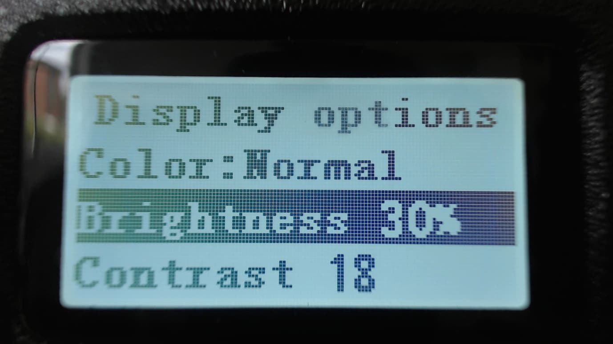

Colour mode
: This option allows for Normal or inverse colour display. Normal is white background with black pixels; Inverse is black background with white pixels.
: Note. This does not completely replicated the GD-77 “Black” display hardware version, because that radio uses a different LCD panel which physically has a back background, whereas the normal GD-77 have a LCD panel with white background

Brightness
: The OpenGD77 firmware allows the display backlight brightness to be controlled from 100% to 0%, in 10% steps between 10% and 100% and below 10% the brightness is controlled in 1% steps.
: The default backlight brightness (default 100%).
: Use the Right and Left arrow keys to adjust the brightness.

Contrast
: The OpenGD77 firmware allows the display contrast to be controlled. 
: The values are the number sent to the LCD panel controller, with a usable range from 12 to 30. Higher values result in more contrast, but also increase the darkness of the background.
: The Official firmware uses a value of 12, however this is did not appear to be the optimum value, so the OpenGD77 firmware uses 18 as the default. 

Timeout
: Sets the time before the display backlight is extinguished (default 5 seconds).
: Setting this value to zero prevents the backlight from turning off at all.

### Channel Details

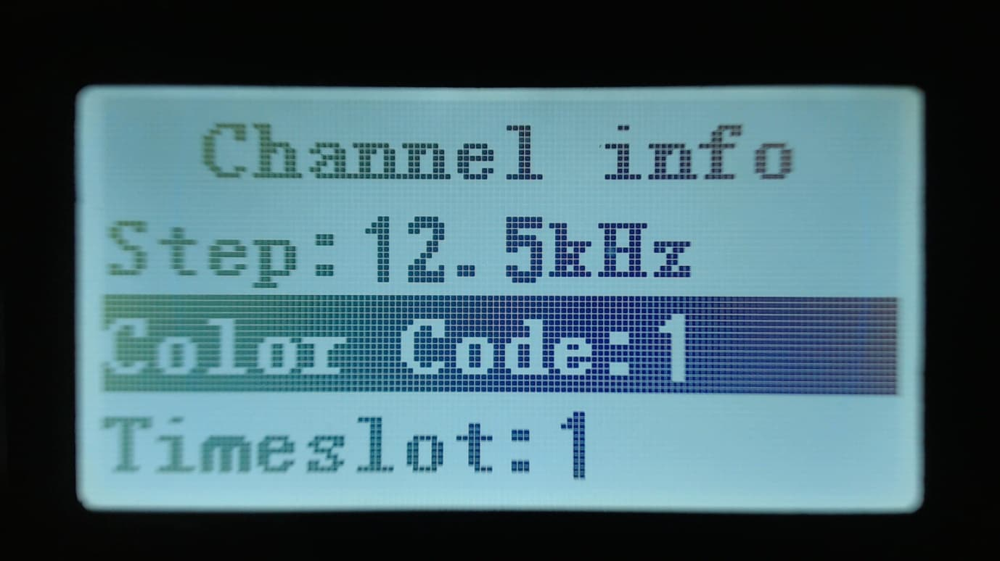

Step
: Selects the VFO/Channel frequency step size.

Color Code
: Sets the color code when the VFO/Channel is set to DMR

Timeslot
: Selects DMR Timeslot 1 or 2 when the VFO/Channel is set to DMR.

Tx CTCSS
: Sets the transmit CTCSS tone when the VFO/Channel is set to FM

RX CTCSS
: Sets the receive CTCSS tone when the VFO/Channel is set to FM

Bandwidth
: Sets the Rx and Tx bandwidth in FM mode to either 25Khz or 12.5Khz 

Pressing the **Green** menu key confirms the changes and saves the settings to the codeplug, or in the case of the VFO the changes are saved to the non-volatile settings.  
Pressing the **Red** menu key closes the menu without making any changes to the channel.

### Credits

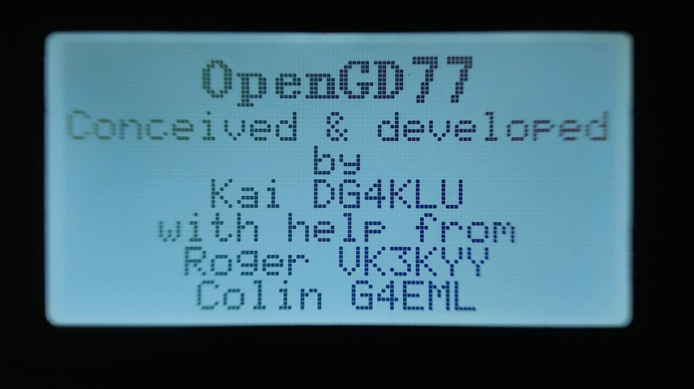

Details of the creators of OpenGD77 firmware.

If other developers contribute to the development effort they will be added to this screen, and  the addition details will be viewed by pressing the **Down Arrow** to scroll the text

## Making and receiving DMR Private Calls

### To make a Private Call

In DMR mode, either in the VFO or the Channel screen...

* Press the # key twice to enter the Private Call DMR ID

* The top of the screen will now show “PC entry” 

* Enter the station’s DMR ID e.g. 5053238 

* Press the Green menu key to conform, or the Red menu key to exit.

Note.

If you make a mistake when entering the number, press the **Left** arrow key to erase the digits one by one.

If the PC ID you entered is in the DMR ID database, you had previously uploaded to the radio, the stations Callsign and name will now be displayed on the screen.

If the ID is not in the DMR ID database, the text “ID: “ followed by the number will be displayed

**The radio is now in Private call mode.**

To return to normal Talkgroup operation, there are 3 methods

1. Press **Function + Red** menu key

2. Press the **Left or Right** arrow key which will load the next TG in the Rx Group list assigned to the VFO or the Channel

3. Press the **Hash (#)** key, then enter a TG number and press the **Green** menu key.

*Note*

When in Private Call mode, changing to from the VFO mode the Channel mode and vice versa, via the Red menu key will not change go back to TalkGroup mode

### To Receive a Private Call

On receipt of a private call, the radio will display this screen

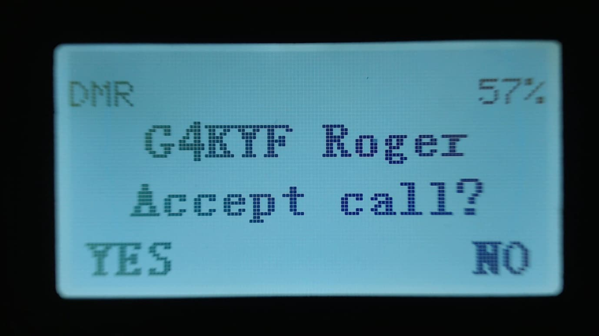

With the callers Callsign and Name (or ID) displayed on the above this text on the display.

To Accept the call, and configure the radio to return the Private call back to the calling station, Press the **Green** menu button, for YES. Otherwise either press the **Red** menu key, for No, or ignore the prompt and continue using the radio as normal.

If you accept the Private Call, the radio will be switched into Private Call mode, ready for transmission. So that the callers ID or name is show e.g.

Once the private call is complete, you can return to the Talkgroup you were on prior to accepting the Private Call, by pressing **Function + Red** menu key. (or by any of the methods described in the section on making a Private Call)

## Hotspot mode

*Note.  At the time of writing Hotspot mode does not work in the Tier 2 version of the firmware.*

The OpenGD77 firmware can operate as a DMR (*voice only*) hotspot when connected via its USB programming cable to a Raspberry Pi running PiStar or any other device that is running MMDVMHost.

Note. 

Hotspot mode is not compatible with software like BlueDV

First, connect the GD-77 to a Raspberry Pi via its programming cable.

Hotspot mode works with the Raspberry Pi Zero, but a adaptor cable is needed to convert from the micro USB port on the RPi Zero to the full size USB plug on the GD-77 programming cable.

In the PiStar Configuration screen, select “OpenGD77 DMR hotspot (USB)” as the modem type.

If your version of PiStar does not contain the OpenGD77 DMR Hotspot as an option, please update your version of PiStar.

With the GD-77 already connected and turned on, after the modem type is changed in PiStar, the display will change on the GD-77 to show its in Hotspot Mode, and will show the Colour Code, Receive frequency and approximate Tx power in mW.

If the GD-77 does not enter Hotspot mode, power cycle the GD-77 and power cycle PiStar

If the GD-77 still fails to enter hotspot mode, check your USB connections.

Note.

By default PiStar configures the “modem” to have a power setting of “100” in the Expert -> MMDVMHost settings.

This is 100% of the maximum power of the modem, and in the case of the GD-77 the maximum power output is 5W, but the radio is not designed to operate as a hotspot, where it may be continuously transmitting.

The maximum power setting that the GD-77 can support for continuous transmission, will vary depending on the operating environment, including the ambient temperature and antenna SWR etc.

It’s the responsibility of the user to set an appropriate power level that will not overheat and damage the PA. 

In Hotspot mode, if PiStar (MMDVMHost) sends a power setting of 100% it, the assumption is that that PiStar has not been correctly configured for the OpenGD77 and this value is disregarded.

Instead the firmware will use the power setting specified by the user in the Utilities menu, which will default to 1W.

If the power setting in the PiStar MMDVMHost Expert settings is any other value e.g. 50%, the hotspot will use that power value e.g. 2.5W (2500mW)

The receive frequency specified by PiStar will be displayed at the bottom of the screen.

Note.
Offsets should not be applied to the Tx or Rx frequencies in PiStar, because the GD-77 should not need any offsets, and any offset will be reflected in the frequency displayed on the GD-77, because PiStar actually sends the master frequency +/- the offset to the hotspot.

When the GD-77 receives a RF DMR signal, the green LED on the top of the GD-77 will illuminate as normal, and the name and callsign are displayed if the DMR ID database contains that ID. If the ID is not in the DMR ID database, the ID number will be shown.

When PiStar receives traffic from the Internet and sends it to the hotspot for transmission, the hotspot displays the Callsign and name or the DMR ID, and the Tx frequency is show.

The LED on the top of the radio also turns red to indicate the radio is transmitting

## Programming Channels and Talkgroups for use with OpenGD77.

**NOTE**: You cannot use the standard Radioddity CPS to write to a GD-77 flashed with the OpenGD77 firmware. If you wish to use the Radioddity CPS the radio will need to run the official Radioddity firmware. Once the code plug has been written to the GD-77 you can then flash the OpenGD77 firmware to the radio and it will then read and operate with the code plug written to it with the standard firmware and CPS software.

As an alternative to the Radioddity CPS you can use the latest version of the “Community CPS” by Roger Clark that includes support for OpenGD77. Please see the next section for information specific to the Community CPS. The information in the rest of this section is applicable to both the standard Radioddity CPS and the Community CPS.

### OVERVIEW 

With OpenGD77, unlike most commercial DMR radios it is not necessary to create multiple channels to use the same frequency with many different transmit Talkgroups. 

In DMR mode when using either the VFO or the Zones and Channels, you can use the LEFT/RIGHT arrow keys to scroll through and select any of the Talkgroups in the Rx Group list assigned to the current channel, or to VFO A

When programming the radio using the CPS first add all the Talkgroups that you think you may wish to use into the Digital Contacts list. 

Please download the latest GD77 Community CPS from here:  
https://github.com/rogerclarkmelbourne/radioddity_gd-77_cps/raw/master/installer/RadioddityGD77CPS31XCommunityEditionInstaller.exe

Next create one or more “RX Group Lists” and populate each with the sets of the Talkgroups that you will want to use with different channels. You can have the same Talkgroups in many RX Group Lists.

Now setup the channels. Enter the frequencies, slot and colour code as normal for a DMR channel. 

Note. Currently the OpenGD77 firmware does not use the “Contact” eg. Shown as TG9 below. Instead it uses the TG’s in the Rx Group list. 
However we advise all users to set the “Contact” to the first channel in the Rx Group list assigned to the channel

Next select the RX Group List that you wish to use for the channel. 

Currently the OpenGD77 firmware does not use the Rx Group list to filter the incoming DMR signal. It is in “Digital Monitor Mode” (aka promiscuous mode) all the time.

However in the future the firmware will optionally allow filtering so that the radio only accepts stations transmitting on one of the TG’s in the Rx Group List

*Please note. The “Contact” is not used by the OpenGD77 firmware. You must use the Rx Group list to define the TG’s you want to use with each channel.
Hence you must have at least 1 Rx Group and it must contain at least 1 Digital Contact which is a TalkGroup*

Finally save your codeplug to your computer before writing the code plug to the radio using either the standard Radioddity CPS to programme the radio before flashing it to OpenGD77 or if you are using the special OpenGD77 compatible version of the “Community CPS”, (as detailed in the next section) you can write the code plug directly to an already flashed OpenGD77 radio.

## Using the Community CPS to program the OpenGD77

Support for the OpenGD77 has now been included to the Community CPS by Roger Clark, which can be downloaded from here:  
https://github.com/rogerclarkmelbourne/radioddity_gd-77_cps/raw/master/installer/RadioddityGD77CPS31XCommunityEditionInstaller.exe

This version also still supports the official firmware as well as the OpenGD77

#### New Driver Installation

The CPS installer now also installs the OpenGD77 comm port driver, however the comm port driver can be installed manually by downloading the files from  
https://github.com/rogerclarkmelbourne/OpenGD77/tree/master/OpenGD77CommDriver

To install the driver, download and unzip the zip file, and run the .bat file

Once the driver is installed, the Windows device manager should show the “OpenGD77” in the “ports” section of the Windows device manager

#### OpenGD77 Menu

In the CPS there is a new menu item under the Extras menu for OpenGD77 Support, which opens this window

From here you can backup, the internal 64k EEPOM and the 1 mega byte Flash chip, as well as Reading and Writing the codeplug.
The calibration data store in the Flash chip (At address 0x8f000) can be backed up and restored without backing up the whole of the Flash. 

*Please note, if you restore the Flash you will also overwrite the calibration data as it’s stored in the 1Mb Flash chip.*

#### Backup Before You Do Anything Else!

Before writing a codeplug to the radio, you should backup both the EEPROM and Flash chip, and save the files somewhere safe, in case something goes wrong in the future and you need to restore the data.

#### Reading and Writing Your Codeplug

To read the codeplug, press the “Read codeplug” button, wait for all 3 data sections to download, and then close the OpenGD77 Support window. To write a codeplug press the “Write codeplug” button.

#### Writing DMR ID’s

The OpenGD77 supports extended DMR ID information, with up to 15 character for Callsign and name, as well as doubling the memory capacity for DMR ID’s.

Please select the “Enhanced firmware mode” Checkbox, and change the Number of characters menu to the desired DMR callsign and name length.  
Note. Because the memory size used for the DMR ID is currently limited to 256, you can store more DMR ID’s if you assign fewer characters per ID. 

