# OpenGD77 User Guide
OpenGD77 is a work-in-progress, so is this User Guide. Last major update was on 18th December 2019. For documentation ToDo (including incremental changes), please refer to https://github.com/jangelor/OpenGD77/wiki/Documentation-ToDo . For latest discussions, please refer to the development and community forum at https://opengd77.com .
<!-- MDTOC maxdepth:6 firsth1:1 numbering:0 flatten:0 bullets:1 updateOnSave:1 -->

- [OpenGD77 User Guide](#opengd77-user-guide)   
   - [Introduction](#introduction)   
      - [Credits](#credits)   
      - [Download links and other resources](#download-links-and-other-resources)   
   - [Installation](#installation)   
   - [Main screens (VFO and Channel screens)](#main-screens-vfo-and-channel-screens)   
      - [Changing between VFO and Channel](#changing-between-vfo-and-channel)   
      - [Changing Timeslot in DMR mode](#changing-timeslot-in-dmr-mode)   
      - [Controlling Tx power](#controlling-tx-power)   
      - [Signal strength bar graph](#signal-strength-bar-graph)   
      - [Channel screen specific functionality](#channel-screen-specific-functionality)   
         - [Changing channels within the current zone](#changing-channels-within-the-current-zone)   
         - [Changing zones](#changing-zones)   
         - [Channel screen Quick Menu](#channel-screen-quick-menu)   
            - [Scan](#scan)   
            - [Copying a channel to VFO](#copying-a-channel-to-vfo)   
            - [Read the VFO into the current channel](#read-the-vfo-into-the-current-channel)   
            - [Filter (DMR only)](#filter-dmr-only)   
         - [VFO Quick Menu](#vfo-quick-menu)   
            - [VFO selection A or B](#vfo-selection-a-or-b)   
            - [Exchange the TX and RX frequencies](#exchange-the-tx-and-rx-frequencies)   
            - [Copy the RX frequency to the TX frequency](#copy-the-rx-frequency-to-the-tx-frequency)   
            - [Copy TX frequency to the RX frequency](#copy-tx-frequency-to-the-rx-frequency)   
            - [Filter (DMR mode only)](#filter-dmr-only)   
            - [Tone Scan for CTCSS tone in FM, or CC Scan for DMR Colour Code in DMR mode](#tone-scan-for-ctcss-tone-in-fm-or-cc-scan-for-dmr-colour-code-in-dmr-mode)   
      - [DMR specific functionality (VFO and Channel screens)](#dmr-specific-functionality-vfo-and-channel-screens)   
         - [Timeslot selection](#timeslot-selection)   
         - [DMR ID callsign and name display](#dmr-id-callsign-and-name-display)   
         - [Talker Alias display](#talker-alias-display)   
         - [Talkgroup selection from the Rx Group list](#talkgroup-selection-from-the-rx-group-list)   
         - [Assignment of Timeslot to Digital Contact TalkGroup](#assignment-of-timeslot-to-digital-contact-talkgroup)   
         - [TalkGroup displayed in inverse video](#talkgroup-displayed-in-inverse-video)   
         - [Manual TalkGroup number entry](#manual-talkgroup-number-entry)   
         - [Private Call number entry](#private-call-number-entry)   
         - [Digital Contact selection](#digital-contact-selection)   
         - [Station DMR ID number entry](#station-dmr-id-number-entry)   
      - [FM specific functionality (VFO and Channel screens)](#fm-specific-functionality-vfo-and-channel-screens)   
         - [FM and FM Narrow](#fm-and-fm-narrow)   
         - [CTCSS tone](#ctcss-tone)   
         - [Squelch](#squelch)   
         - [1750Hz Tone for repeater operation](#1750hz-tone-for-repeater-operation)   
         - [DTMF tone transmission](#dtmf-tone-transmission)   
      - [VFO specific functionality](#vfo-specific-functionality)   
         - [Frequency change up/down step](#frequency-change-updown-step)   
         - [Numerical frequency entry](#numerical-frequency-entry)   
         - [To adjust the TX frequency, independent of the RX frequency](#to-adjust-the-tx-frequency-independent-of-the-rx-frequency)   
   - [Transmitting](#transmitting)   
      - [Timeout warning beep](#timeout-warning-beep)   
      - [TOT](#tot)   
   - [Other screens](#other-screens)   
      - [Lock screen](#lock-screen)   
      - [Text entry](#text-entry)   
   - [The control keys and buttons](#the-control-keys-and-buttons)   
   - [The Menu System](#the-menu-system)   
   - [Main Menu](#main-menu)   
      - [Zone](#zone)   
      - [RSSI](#rssi)   
      - [Battery](#battery)   
      - [Last Heard](#last-heard)   
      - [Firmware Info](#firmware-info)   
      - [Options](#options)   
         - [DMR mic](#dmr-mic)   
         - [Beep volume](#beep-volume)   
         - [Band Limits](#band-limits)   
         - [Calibration](#calibration)   
         - [Fact Reset](#fact-reset)   
         - [Timeout beep](#timeout-beep)   
         - [Squelch UHF](#squelch-uhf)   
         - [Squelch 220](#squelch-220)   
         - [Squelch VHF](#squelch-vhf)   
         - [Scan mode](#scan-mode)   
         - [Scan delay](#scan-delay)   
         - [Filter time](#filter-time)   
         - [Key rpt](#key-rpt)   
         - [Key long](#key-long)   
      - [Display Options](#display-options)   
         - [Colour mode](#colour-mode)   
         - [Brightness](#brightness)   
         - [Contrast](#contrast)   
         - [Timeout](#timeout)   
         - [Order](#order)
         - [Contact](#contact)
      - [Channel Details](#channel-details)   
         - [Mode](#mode)   
         - [Color Code](#color-code)   
         - [Timeslot](#timeslot)   
         - [TX CTCSS](#tx-ctcss)   
         - [RX CTCSS](#rx-ctcss)   
         - [RX](#rx)   
         - [TX](#tx)   
         - [Bandwidth](#bandwidth)   
         - [Step](#step)   
         - [TOT](#tot)   
         - [Zone Skip](#zone-skip)   
         - [All Skip](#all-skip)   
         - [RX Grp](#rx-grp)   
      - [Credits Screen](#credits-screen)   
   - [Making and receiving DMR Private Calls](#making-and-receiving-dmr-private-calls)   
      - [To make a Private Call](#to-make-a-private-call)   
      - [To Receive a Private Call](#to-receive-a-private-call)   
   - [Hotspot mode](#hotspot-mode)   
   - [Programming Channels and Talkgroups for use with OpenGD77](#programming-channels-and-talkgroups-for-use-with-opengd77)   
      - [Overview](#overview)   
         - [New Driver Installation](#new-driver-installation)   
         - [OpenGD77 Menu](#opengd77-menu)   
         - [Backup Before You Do Anything Else](#backup-before-you-do-anything-else)   
         - [Reading and Writing Your Codeplug](#reading-and-writing-your-codeplug)   
         - [Writing DMR IDs -- the User Database](#writing-dmr-ids-the-user-database)   

<!-- /MDTOC -->

## Introduction

This user guide is a work in progress as is the Open GD77 firmware. If you find any errors or omissions please let me know so they can be corrected.

This manual covers both the original Tier 1 / Phase one version, which includes Hotspot mode, as well as the Tier 2 Alpha versions which don’t include Hotspot mode, but to have other new features.

Due to the rapid pace of development some of photos of screens are now out of date and not completely accurate.

The photos will be updated when the firmware in a particular area stabilises

The intention of the OpenGD77 project is to create a fully featured non-commercial firmware that entirely replaces the Radioddity GD-77’s factory firmware. This firmware is specifically designed for **Amateur Radio** use, and has features not available in the official firmware.

**Note:**
**The firmware is still under development and there are some key areas of functionality which have yet to be written.**

1. Currently the stable firmware works in Tier 2 and hotspot modes.

   There is pre-release (Alpha 2) version which supports Tier2 as well as advanced functions, repeater and duplex hotspot operation, but it is currently under development and may have some minor issues.

1. FM RX and TX transmission works.

   This includes repeater operation using CTCSS on both TX and RX.

1. On DMR, only Talk Group “calls” and Private calls are currently possible.

   Text messaging and other similar features are currently not supported, but are on the To Do list.

   For a full list of current bugs, and proposed enhancements see
   <https://github.com/rogerclarkmelbourne/opengd77/issues>

The firmware is designed for Amateur Radio use, especially on DMR, and has a number of features for Amateur Radio use which are not normally available on commercial DMR radios.

These include direct numerical entry of DMR TalkGroup numbers and use of the Rx Group list to control the TG’s selectable for each DMR “channel”.

Also, as far as possible the firmware is open source. This allows anyone to modify the firmware to suit their own individual needs, and also for peer review and improvement of the firmware source code.

### Credits

The project was conceived by Kai DG4KLU, who developed the initial framework and all the FM and DMR TX and RX (Tier 1) functionality.

Kai ceased actively participating in the project in June 2019 and at the time of writing Roger VK3KYY is now the lead developer, with help from Alex DL4LEX, Damiel F1RMB and Colin G4EML

The Tier 2 functionality, User Interface, Display driver, Codeplug API, EEPROM memory API, Flash memory API, Hotspot mode and many other features were developed by Roger VK3KYY

Multiple bug fixes and additions from Alex DL4LEX, including the Lock Screen and DTMF and Tone burst functions

Graphical and other enhancements from Daniel F1RMB

Additions from Colin G4EML, including FM CTCSS and “All Channels” zone functionality

This user guide was written by Roger VK3KYY based on work by Alister G0NEF. Additional edits by Angelo 4I1RAC and Bud W0RMT, and graphics by Thierry F1CXG (buttons) and Rafa EA3BIL (menu map).

Thanks to all the Beta Testers that provide detailed bug reports and user feedback, especially VK7ZCR, W1RHS and G4TSN

### Download links and other resources

**Firmware source code and binaries:**

**Stable version:** (Tier 2 + Hotspot mode)
<https://github.com/rogerclarkmelbourne/OpenGD77/blob/master/firmware_binaries/daily_builds/OpenGD77_stable.sgl>

**Tier 2 “Alpha 2” version:** (includes Hotspot mode)
<https://github.com/rogerclarkmelbourne/OpenGD77/blob/master/firmware_binaries/daily_builds/OpenGD77_latest.sgl>

**GD-77 Community CPS with support for OpenGD77:** 
<https://github.com/rogerclarkmelbourne/radioddity_gd-77_cps/blob/master/installer/OpenGD77CPSInstaller.exe>

**OpenGD77 CPS with support new features like 80 channel zones:**
<https://github.com/rogerclarkmelbourne/radioddity_gd-77_cps/raw/master/installer/OpenGD77CPSInstaller.exe>

**OpenGD77Forum:** 
<http://www.opengd77.com/>

## Installation

The firmware can be installed onto the GD-77 using the firmware update tool provided by Radioddity with their official firmware update packages. This can be downloaded from Radioddity’s website [radioddity.com](https://radioddity.com/) . See Radioddity’s documentation on how to use their firmware update tool.

The Community and OpenGD77 CPS now also has a feature in the Extras menu to upload the firmware into the radio.

The OpenGD77 firmware (.sgl file) can be downloaded from Github, using either of the links as listed in section 1.1 of this guide.

Installation of the OpenGD77 firmware is undertaken at the owners own risk, but the official firmware can usually be reloaded onto the GD-77 if the user has problems with the OpenGD77 firmware.

*Note:* The official Radioddity GD-77 CPS PC software is not compatible with the OpenGD77 firmware, and the “Community CPS” or the "OpenGD77 CPS" should be used instead. This can be downloaded from the link show in section 1.1 of this guide

## Main screens (VFO and Channel screens)

The OpenGD77 firmware has 2 main screens.  The VFO screen and the Channel screen. These are similar to the channel and VFO screens in the official firmware, except have additional functionality.

Initially after the OpenGD77 firmware is installed, the VFO screen will be displayed.

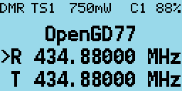

The frequency used in the VFO for both Tx and Rx will be read from the “VFO A” settings of the codeplug.

On both the VFO and Channel screens, the mode (DMR or FM) is shown in the top left of the display, and the battery voltage percentage is shown in the top right of the display

In DMR mode the current TimeSlot is shown to the right of the “DMR” text e.g TimeSlot 2 "TS2", and the Colour Code e.g. “C1” is shown to the left of the battery percentage. When TimeSlot filtering is turned off, the **TS1** or **TS2** indicator is in inverse color.

The current Tx power is shown in the middle of the top of the screen (e.g., 750mW)

On the VFO screen, the TX and RX frequency are shown, as well as the TalkGroup when in DMR mode.

The arrow to the left of the R (receive frequency) indicates that the keypad up and down arrows and number entry keys will control the RX frequency.

The channel screen displays the same information in the top row, but displays the Channel name (in this example “Lee Hill”) as well as the Zone (“Home DMR”). In DMR mode the TalkGroup (in this case "ColoradoHD") will also be displayed

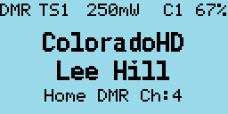

On both the VFO and Channel screens:

Press the **Red** menu button to toggle between the VFO and Channel screens

Press the **Green** menu key to enter the menu system

Press **Function + Green** for quick access to the Channel details screen, which can also be accessed via the menu system.
*Note:*
The VFO is actually a special type of channel; hence the Channel Details screen also works for the VFO.

### Changing between VFO and Channel

Press the **Function + Star** key to toggle between FM and DMR mode on either the VFO or Channel screens.

### Changing Timeslot in DMR mode
In DMR mode, pressing the **Star** key toggles between TimeSlot 1 and TimeSlot 2.

### Controlling Tx power

Press **Function + Right** to increase the power. Press **Function + Left** to decrease the power. Power can be set to 250mW, 500mW, 750mW, 1W, 2W, 3W, 4W and 5W.
*Note:* The power output will only be correct after the operator has calibrated their own radio, as the GD-77 does not seem to have very accurate power calibration applied in the factory by TYT.

### Signal strength bar graph

In both FM and DMR mode, the signal strength of the received signal is show as a bar graph across with width of the screen. 100% bar graph is approximately S9 +40 dB.

In DMR mode the signal meter will only be active when the DMR hardware detects a DMR signal.

In FM mode the signal meter should operate all the time.

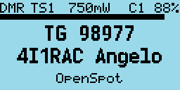

### Channel screen specific functionality
The Channel screen displays the current Channel number as well as the current zone.

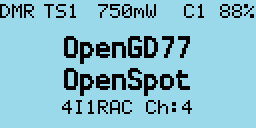

#### Changing channels within the current zone

Pressing the **Up** or **Down arrow** keys changes channel in current zone, and the channel number in the zone will be displayed beside the zone name.

#### Changing zones

Pressing **Function + Up arrow** or **Function + Down arrow** changes to the next or previous zone, respectively.

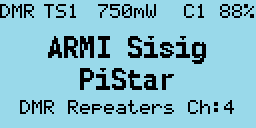

#### Channel screen Quick Menu

Pressing the **Orange** button on the top of the radio in Channel mode displays the Quick Menu for the Channel screen. Note that in Quick Menu, the **Orange** button has the same function as the **Green** key, which confirms your current selection.

##### Scan

After pressing the **Orange** button, press it again, or press the **Green** key to start scanning all channels in the currently selected zone.

Whilst scanning the mode indicator DMR or FM will flash.

##### Copying a channel to VFO

Press the **Orange** button or **Green** key to copy the content of the current channel to the VFO.

##### Read the VFO into the current channel

Press the **Orange** button or **Green** key to confirm and save the updated channel to the codeplug memory. **Red** key to cancel.

##### Filter (DMR only)

Use the **Right** or **Left** arrows to select **TS** (to filtering by the selected timeslot), **TS, TG** (to filter by the selected timeslot and also the selected Talkgroup) or **None** (for no filtering, i.e. "promiscuous" mode).

When timeslot filtering is disabled, the TS1 / TS2 indication at the top of the screen is displayed in inverse video.
When Talkgroup filtering is enabled the DMR  mode indication at the top of the screen is displayed in inverse video.

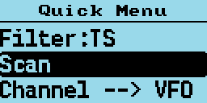

#### VFO Quick Menu

Pressing the **Orange** button on the top of the radio in VFO mode displays the Quick menu for the VFO screen. Currently this has five options.

##### Scan

After pressing the **Orange** button, press it again, or press the **Green** key to start scanning.
Note. Before scanning can commence the start and end frequencies need to be defined using the other Quick menu options.

Whilst scanning the mode indicator DMR or FM will flash.

##### VFO selection A or B

Pressing the **Orange** button twice while in VFO mode quickly toggles between VFO A and VFO B.

##### Exchange the TX and RX frequencies

This function essentially reverses the TX and RX frequencies. Press **Green** key or **Orange** button to confirm.

##### Copy the RX frequency to the TX frequency

Copies the RX frequency to the TX frequency. Press **Green** key or **Orange** button to confirm.

##### Copy TX frequency to the RX frequency

Copies the TX frequency to the RX frequency. Press **Green** key or **Orange** button to confirm.

##### Filter (DMR mode only)

Use the **Right** or **Left** arrows to select **TS** (to filtering by the selected timeslot), **TS, TG** (to filter by the selected timeslot and also the selected Talkgroup) or **None** (for no filtering, i.e. "promiscuous" mode).

When timeslot filtering is disabled, the TS1 / TS2 indication at the top of the screen is displayed in inverse video.
When Talkgroup filtering is enabled the DMR  mode indication at the top of the screen is displayed in inverse video.

##### Tone Scan for CTCSS tone in FM, or CC Scan for DMR Colour Code in DMR mode

In analog mode, this scans for any CTCSS tone. In DMR mode, it scans across the different Colour Codes to receive signals in the set VFO RX frequency.

Press the **Orange** button or **Green** key to confirm the copy or **Red** key to cancel.

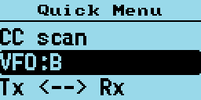

*Note.*

Listening to the input of a repeater will only work in DMR mode if both the TX frequency and the RX frequency are the same. This is because most DMR radios do not give an option to select Tier2 Active or Tier 2 Passive mode, and instead assume that if the TX and RX frequencies are the same the radio needs to be in Active mode, where the radio is the DMR master. Meanwhile, if the TX and RX frequencies are not the same the radio assumes it needs to operate in Tier 2 Passive mode, wherein the repeater signal controls the DMR timeslot synchronization.

However to listen on the input of a repeater, the signal that is received does not contain the synchronisation information hence the radio needs to be put into DMR Active mode in order to receive the signal.

I am not sure whether the official firmware is able to receive on the input of a repeater if a channel was setup with the TX and RX frequencies swapped, but because of the way the OpenGD77 firmware actually monitors both TimeSlots simultaneously, but only decodes the TG/ID and audio for the selected TS.

### DMR specific functionality (VFO and Channel screens)

#### Timeslot selection

The **Star** key toggles between TimeSlot 1 and TimeSlot 2

#### DMR ID callsign and name display

When a DMR signal is received which uses the same Colour Code as selected for the VFO or Channel, the radio display will show the station’s Talkgroup and DMR ID

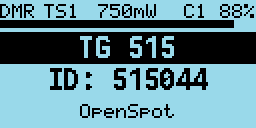

If the DMR ID is in the DMR ID database previously loaded into the radio, the callsign and name will be displayed.

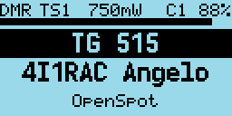

#### Talker Alias display

If receiving a signal from the Brandmeister network, and if the station’s DMR ID is not in the radio's DMR ID database, the display will show the Talker Alias information sent by Brandmeister.

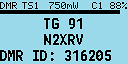

The callsign will be displayed in the centre of the screen, and additional information will be displayed at the bottom of the screen. The additional information will default to the text “DMR ID:” followed by the stations DMR ID number.

If the station has entered any data into the APRS section of their Brandmeister “Self care” page, that text will be display in place of the DMR ID number.

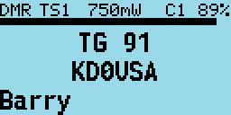

Note: As the Talker Alias data is sent slowly as it is embedded inside the DMR audio data frames, the callsign will appear first and about half a second later the DMR ID or other text will arrive via the DMR data and be displayed.

#### Talkgroup selection from the Rx Group list

Press the **Left** or **Right** Arrow keys to cycle through the TalkGroups in the TGlist assigned to the VFO or Channel in the CPS.
This TalkGroup will apply to both RX and TX.

#### Assignment of Timeslot to Digital Contact TalkGroup

A new feature introduced to the CPS allows a default TimeSlot to be applied to each Digital Contact or TalkGroup.

By default, the Channel TS override is disabled. This means that if the **Left** or **Right** arrows are pressed to select this TG within the Rx Group list, the Timeslot assigned to the Channel (in the CPS) or manually changed using the **Star** key will not change.

However if the Digital Contact has an override TS assigned (e.g., TS 1), when this Digital Contact TG is selected by pressing the **Right** or **Left** arrows, the Timeslot will be set to the Timeslot assigned to the Digital Contact TG.

#### TalkGroup displayed in inverse video

If a Talkgroup is displayed in inverse video during reception of a DMR signal, this indicates that the current TX TalkGroup does not match the received TalkGroup, hence pressing the PTT would not transmit back to the station on the same TalkGroup.

If you want to transmit on the same TalkGroup as the currently received signal, press the **Function** button on the side of the radio while the TalkGroup is being displayed in inverse. The TX TalkGroup will now be set to the RX TalkGroup.

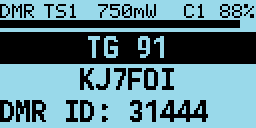

#### Manual TalkGroup number entry

Press the **Hash (#)** key to enter an *ad hoc* TalkGroup number, followed by the **Green** key to confirm.
If the entered TG is in the Digital Contacts the name of the TG Contact will be displayed, otherwise the number will be displayed e.g. TG 98977.

When a TG has been manually entered, the display shows a 1 pixel box around the TG display area to indicate that this TG has been manually entered, even if the Contact / TG name is displayed rather than the TG nunber.

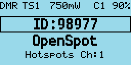

#### Private Call number entry

Press the **Hash (#)** two times to enter a Private Call DMR ID number.

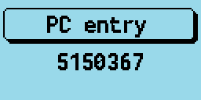

In all numeric entry screens, pressing the Red menu key exits back to the previous screen, either the VFO or Channel screen.

#### Digital Contact selection

Press the **Hash (#)** three times to access the Digital contacts defined in the CPS.

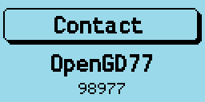

The contact name is show in the middle of the screen, e.g. “TG 505 TS2” and the TalkGroup or PC number is shown in smaller text at the bottom of the screen.

Press the **Up** or **Down** arrows to cycle through the list of Digital Contacts

Press **Green** to select or **Red** to cancel.

Private calls can also be selected in this manner.

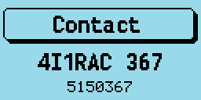

#### Station DMR ID number entry

In Contact selection mode, press **Function + Hash (#)** key, and an alternative DMR ID can be entered for the radio (for test purposes) to temporarily override your normal DMR ID number which was loaded from the codeplug.

This DMR ID will be used for transmission *until* the radio is rebooted or you enter another DMR ID via the same screen.

To make the change permanent, so that its written back to the codeplug Press **Function + Green** instead of **Green** to confirm the number.

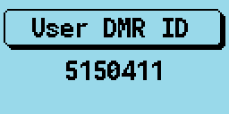

### FM specific functionality (VFO and Channel screens)

#### FM and FM Narrow

For FM with 25kHz bandwidth with the text “FM” is displayed in the top left of the screen. For narrow band with 12.5kHz bandwidth the text “FMN” is displayed.

#### CTCSS tone

This can be set for the Channel or VFO, the letters **CT** **CR** or **CTR** will be displayed next to the FM indication at the top of the screen.

**CT** means CTCSS TX tone only. **CR** means CTCSS RX tone only. **CTR** means CTCSS TX and RX tones.

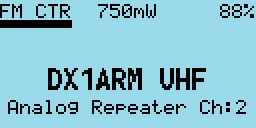

#### Squelch

Pressing **Left** or **Right** keys, controls the FM squelch.

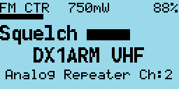

Once in squelch control mode, pressing **Right** tightens the squelch incrementally, **Left** opens up the squelch incrementally. The VFO and each channel have individual squelch settings that can be set in this manner.

The variable squelch can be set to different values for each Channel and for the VFO using a new feature in the Community CPS, where the squelch can be set anywhere between Open and Closed in 5% steps.

In this example the squelch in the VFO is set to 20%.

If the squelch is changed in the VFO the value will be remembered even if the radio is power cycled. However if the squelch on a channel is changed, the value is only a temporary override.

To make the squelch change permanent to a Channel, press **Function + Green** to enter the Channel Details screen, and then press **Green** again to save the channel data to the codeplug.

Note.
If RX CTCSS is enabled, this has priority over the squelch control, and lowering the squelch threshold will not cause the squelch to be opened.

#### 1750Hz Tone for repeater operation

Pressing the **Function** button during FM transmission, sends the 1750Hz tone required for some repeater operation.

#### DTMF tone transmission

Pressing any key (except the Green and Red menu keys) on the keypad during transmission will transmit the DTMF tones for that key.

The tone will also be audible through the speaker.

### VFO specific functionality

The VFO displays both the TX and RX frequency at all times.

When the currently selected frequency is the **RX** frequency, an arrow is displayed to the left of the “**R**”, changes to the frequency will adjust both the TX and RX frequencies.

#### Frequency change up/down step

Pressing the **Up** or **Down** arrows will change frequency by the value defined in the frequency step value defined for the VFO in the CPS.

The step can be adjusted by pressing **Function + Green** to enter the Channel Details mode, and then adjusting the “Step” setting

#### Numerical frequency entry

Pressing any of the number keys allows the direct entry of the frequency.

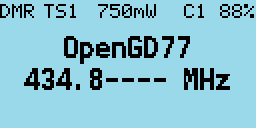

When all digits have been entered, the accept beep tones are played, and the display returns to the VFO screen.

If an invalid frequency is entered the error beep tones are played.

When entering a frequency:

Pressing the **Red** key cancels the entry

Pressing **Left** arrow deletes the digits one by one.

#### To adjust the TX frequency, independent of the RX frequency

Press the **Function** button on the side of the radio, and then the **Down** arrow.

This will change the currently selected frequency to the TX frequency, and the arrow will move to the left of the “**T**” instead of the “**R**”

To change the RX frequency again, press **Function + Up** arrow.

When the TX frequency is changed, the RX frequency will not be changed.

Use this method to set different TX and RX frequencies. For example, this can be useful for satellite operation as it allows Cross Band operation as well as split frequency simplex operation on the same band.

**Note**

If different TX and RX frequencies are set, and the currently selected input is set to RX, changing the RX frequency will also change the TX frequency, and the difference between the RX and TX frequency will be maintained if possible.

The only case where the frequency difference will not be maintained is if the TX frequency goes outside of the range of frequencies supported by the radio hardware.

## Transmitting

During transmission the Talk Timer either counts up or down, depending on whether the channel has a timeout defined.

If a timeout is defined in the CPS, or adjusted in the Channel Details screen, the Talk Timer will count down and when the timeout period is reached a beep will play and the TX will stop.

In DMR Tier2 the timer will not start counting until the repeater becomes active.

During DMR TX a VU meter is displayed showing the input microphone level, in the form of a bar graph across the top of the screen.

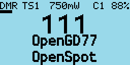

### Timeout warning beep

A timeout warning can be configured in the Utilities menu. The radio will beep every 5 seconds when the remaining call time is less than the Timeout warning time that you have configured in the Options screen.

### TOT

If TOT is setup for the current channel or VFO, when the timer counts down to zero the transmission will stop, a warning beep will be played and the radio will stop transmitting.

## Other screens

### Lock screen

To the lock the keypad.

On either the VFO or the Channel screen, press the **Green** menu key to display the Main menu, then press the **Star** key. Pressing the **Star** key from any top-level item within the Main menu locks the keypad.

To unlock the keypad, press and hold the **Function** button and press the **Star** key

### Text entry

OpenGD77 now supports alphanumeric text entry while creating a new contact or editing an existing one.

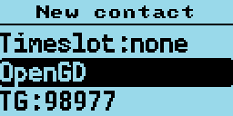

Press **Left** and **Right** to move the cursor. Press **Function-Left** as backspace, and **Function-Right** to insert a space. The keypad entry follows the same functionality as stock GD77 firmware.

## The control keys and buttons

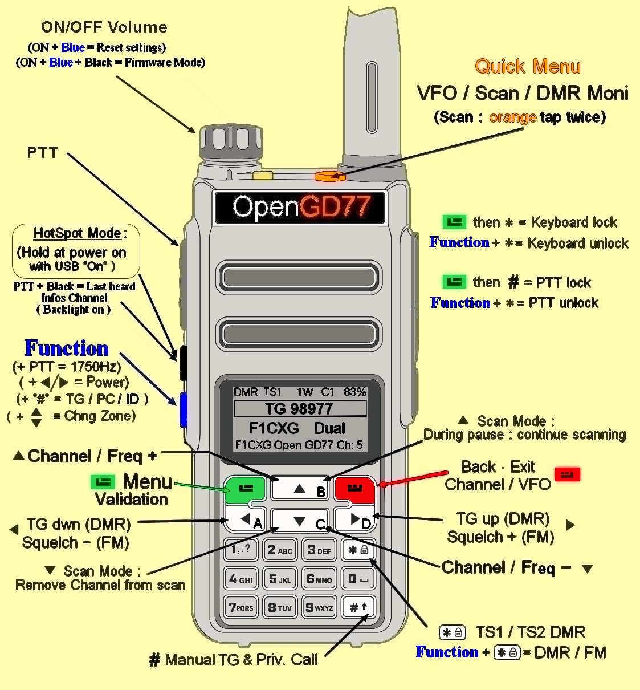

## The Menu System

The Open GD77 firmware utilizes a significantly revised menu structure compared to the official firmware. Targeted at amateur use, this focuses on being more straightforward, with highlight on commonly-used features. Please refer to the menu map below.

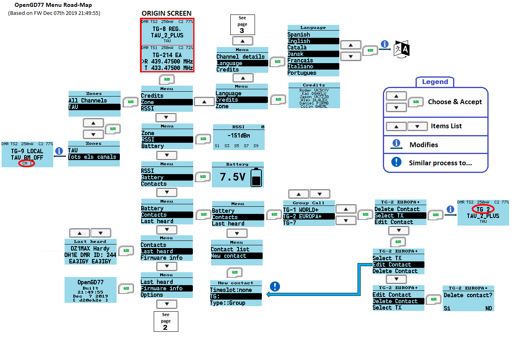

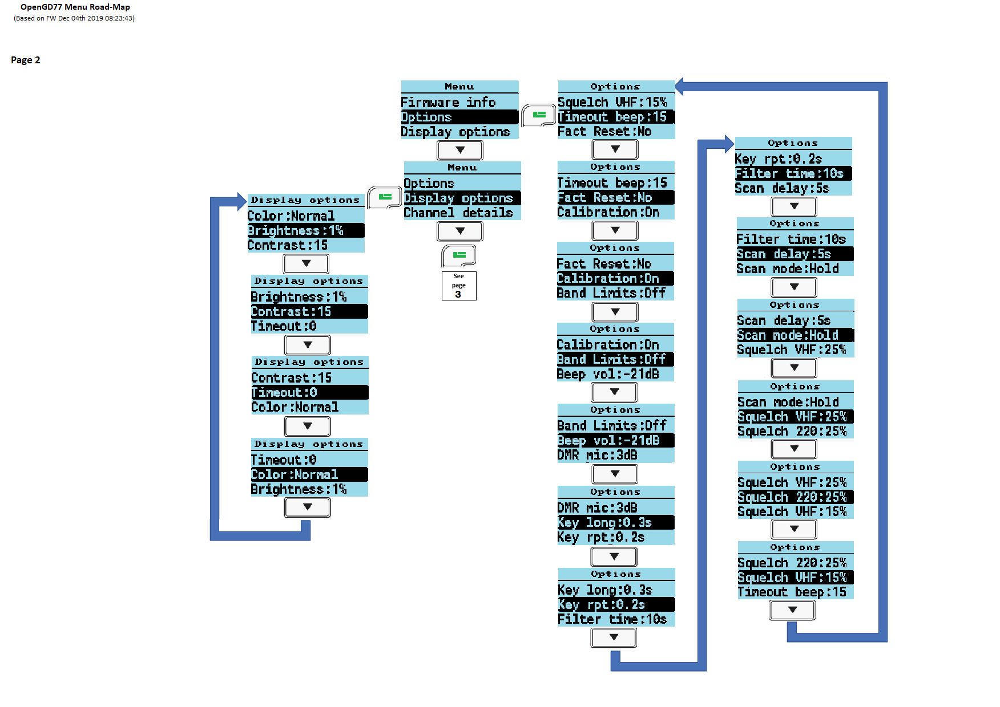

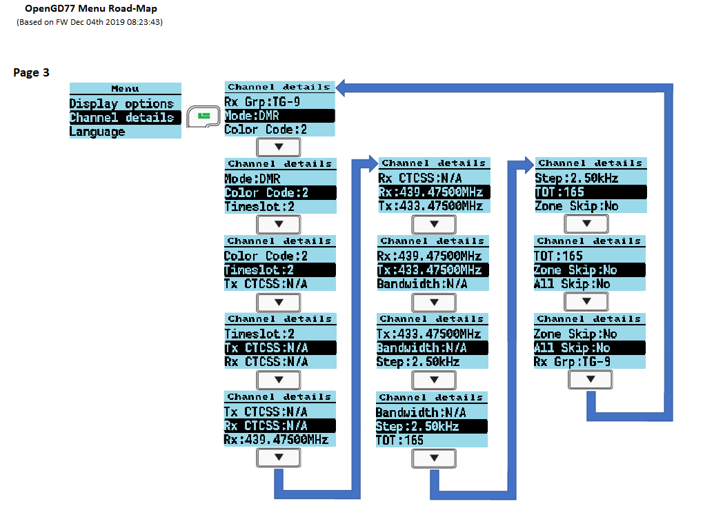

Pressing the **GREEN** key enters the menu system, press again to enter a menu subsection or to exit the menu.

Press the **RED** key to step back one level or to exit the menu system.

The **UP** and **DOWN** arrow keys step up and down through the various pages of the menu system.

The **LEFT** and **RIGHT** arrow keys will change the individual items in the menu system where they are changeable.

The **BLUE** button on the side of the radio, known as SK2, is used as a “**Function**”. Various features are accessed by holding the “function” key when pressing a button on the keypad.

Press the **ORANGE** button to access the quick menu from the standby screen.

## Main Menu

### Zone

This menu is used to select which groups of channels, called a Zone, is used in the Channel screen, and operates in the same way as the official Radioddity firmware, except with one addition.

In addition to the Zones that are defined in the CPS and uploaded to the GD-77 using the Community CPS, the firmware creates a special Zone called **All Channels**.

When the All Channels zone is selected, the Channel screen displays the "**All Channels** and the channel number instead of the zone name and channel number.

Pressing the **Up** and **Down** arrows will cycle though all channels in the zone.

Pressing any of the number keys on the keypad, enters ‘Goto channel number’ mode.

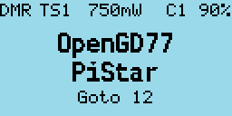

In this mode, you can enter multiple digits and then press the **Green** key to confirm, or the **Red** key to cancel.

Note that you can quickly cycle through zones by holding the **Blue** button and pressing **Up** or **Down** in Channel mode.

### RSSI

Displays a signal strength indicator showing the numerical RSSI value in dBm, along with an S-Unit bar graph.

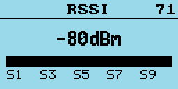

*Notes*

Both RSSI and S meter are not calibrated and will vary somewhat between different radios in their accuracy.

DMR signals by their nature, because they are pulse transmissions will not give accurate RSSI values.

The number in the top right of the display is for debugging purposes and is the number reported by the receiver hardware.

### Battery

Displays the current battery voltage.

Press the **Down** key to display the battery usage chart. This shows the history of battery voltage on an hourly basis.

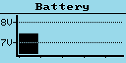

### Last Heard

Displays a record of the last 16 DMR stations that the radio has received.

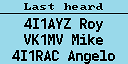

Pressing the **Up** or **Down** arrows cycles through the list to show stations which have been heard.

The radio stores data on the last 16 stations that were heard.

### Firmware Info

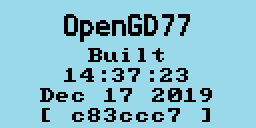

Displays the date and time the firmware was built, and also the Github commit code in brackets.

To view details on Github, append the code to
https://github.com/rogerclarkmelbourne/OpenGD77/commit/

e.g.
https://github.com/rogerclarkmelbourne/OpenGD77/commit/a0ebbc7

### Options

The **Options** screen is the new name for the **Utilities** menu.

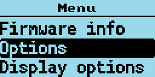

This menu controls various settings specific to the OpenGD77 firmware

#### DMR mic

This controls the audio gain of the DMR microphone input system, relative to the default value.

This only adjusts the gain on DMR, and does not affect the FM mic gain.
Settings are in 3dB steps, with 0dB being the normal default setting, which is the same as the official firmware.

#### Beep volume

This controls the volume of the beep and other tones, and can be set from 100% to 10% in these increments: (-24dB, -21dB, -18dB, -15dB, -12dB, -9dB, -6dB, -3dB, 0dB, 3dB, 6dB).

#### Band Limits

Turns ON/Off the transmit band limit function that prevent transmission outside of the Amateur Radio bands. (Default ON).

#### Calibration

Turns ON/OFF the calibration function (default OFF).

Some radios seem to have invalid calibration data, possibly because the official firmware has corrupted the calibration parameters in the Flash memory. This requires a power cycle for the setting to apply.

If the radio does not seem to transmit or receive correctly, or if it does not work correctly (e.g., high BER) with certain hotspots, try disabling the calibration and rebooting the radio, as the nominal calibration parameters used by the OpenGD77 firmware normally work almost as well as correct calibration data.

#### Fact Reset

Resets the radio to default settings, and reads the CPS VFO A values from the codeplug into the VFO screen. Power cycle the radio to apply.

**The radio can also be set to the default settings by holding the Blue (Function) key while turning on the radio.**

#### Timeout beep

This setting controls whether the radio emits timeout warning beeps during transmission when the timeout is about to expire and transmission will be terminated.

#### Squelch UHF

This setting controls the squelch level for 70cm UHF when using an analog channel or during analog mode in VFO. Default is 45%.

#### Squelch 220

This setting controls the squelch level for 220MHz when using an analog channel or during analog mode in VFO. Default is 45%.

#### Squelch VHF

This setting controls the squelch level for 2 meter VHF when using an analog channel or during analog mode in VFO. Default is 45%.

#### Scan mode

This setting controls how the receiver stops when there is a signal during scan mode. **Hold** continuously tunes in to a channel when a signal is received. **Pause** tunes in to that signal for a specified duration (Scan Delay) and then resumes scan.

#### Scan delay

During scan mode, this controls the duration wherein the radio tunes in to a channel before resuming scan. This works when **Pause** is selected as the scan mode.

#### Filter time

This feature works when TimeSlot filtering is turned off (**Filter: Off** in the Quick Menu). It sets the duration the radio listens in to one particular TimeSlot before resuming listening to the other TimeSlot for traffic. This prevents the radio from switching to the other TimeSlot in the event that there is a long pause or transmission gap in the current TimeSlot being heard. When TimeSlot filtering is turned on (**Filter: TS** in Quick Menu), this does not have any effect.

#### Key rpt

This setting controls the speed of key repetitions when a key is held.

#### Key long

This setting controls the time (in seconds) after which a key is considered to be a long/repetitive press.

### Display Options

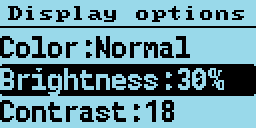

#### Colour mode
This option allows for Normal or inverse colour display. Normal is white background with black pixels; Inverse is black background with white pixels.
*Note.* This does not completely replicated the GD-77 “Black” display hardware version, because that radio uses a different LCD panel which physically has a back background, whereas the normal GD-77 have a LCD panel with white background

#### Brightness
The OpenGD77 firmware allows the display backlight brightness to be controlled from 100% to 0%, in 10% steps between 10% and 100% and below 10% the brightness is controlled in 1% steps. The default backlight brightness (default 100%). Use the **Right** and **Left** arrow keys to adjust the brightness.

#### Contrast
The OpenGD77 firmware allows the display contrast to be controlled. The values are the number sent to the LCD panel controller, with a usable range from 12 to 30. Higher values result in more contrast, but also increase the darkness of the background. The Official firmware uses a value of 12, however this is did not appear to be the optimum value, so the OpenGD77 firmware uses 18 as the default.

#### Timeout
Sets the time before the display backlight is extinguished (default 5 seconds). Setting this value to zero prevents the backlight from turning off at all.

#### Order
Controls where the DMR Contact display data is sourced from
Cc = Digital Contacts (in the codeplug)
Db = DMR ID database
TA = Talker Alias

The default is Cc/Db/TA, which means the receiced DMR ID is first checked in the Digital Contacts, and if not found the internal DMR ID database is searched, and if not found and the DMR transmission includes Talker Alias, then Talker Alias will be used.

#### Contact
Controls the position on the screen where the DMR Callsign and Name etc, is displayed on the screen
Options are
1 Line, 2 Lines or Auto

1 Line - This only uses the middle line of the display to show the callsign and name. When using Talker Alias, which contains more than the 16 characters wide of the screen, the text will be cropped, so you will not see the end of the TA text.

2 Lines - The Callsign is displayed on the middle line of the display, and the name and other information will be displayed on the bottom line of the display. i.e the firmware automatically breaks up the "CALLSIGN NAME" format text at the space separating callsign from the name.

Auto - When the Callsign and name will fit on the middle line of the display, only the middle line will be used (this is equivalent to the "1 Line" option.)
If the caller information e.g. from TA is longer than 16 characters and won't fit on the middle line, the display will be split onto both lines and is equivalent to the "2 Lines" option.

The default is 1 Line.

### Channel Details

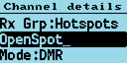

#### Mode

#### Color Code
Sets the color code when the VFO/Channel is set to DMR

#### Timeslot
Selects DMR Timeslot 1 or 2 when the VFO/Channel is set to DMR.

#### TX CTCSS
Sets the transmit CTCSS tone when the VFO/Channel is set to FM

#### RX CTCSS
Sets the receive CTCSS tone when the VFO/Channel is set to FM

#### RX

#### TX

#### Bandwidth
Sets the Rx and Tx bandwidth in FM mode to either 25Khz or 12.5Khz

#### Step
Selects the VFO/Channel frequency step size.

#### TOT
Sets the time out timer to OFF or ON.

#### Zone Skip
Set to skip the channel when scanning within the zone.

#### All Skip
Set to skip the channel when scanning within the All Channels list.

#### RX Grp
Selects which RX group is assigned to teh current channel (DMR only).

Pressing the **Green** menu key confirms the changes and saves the settings to the codeplug, or in the case of the VFO the changes are saved to the non-volatile settings. Pressing the **Red** menu key closes the menu without making any changes to the channel.

### Credits Screen

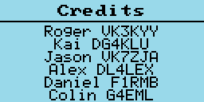

Details of the creators of OpenGD77 firmware.

If other developers contribute to the development effort they will be added to this screen, and the addition details will be viewed by pressing the **Down Arrow** to scroll the text

## Making and receiving DMR Private Calls

### To make a Private Call

In DMR mode, either in the VFO or the Channel screen...

* Press the # key twice to enter the Private Call DMR ID

* The top of the screen will now show “PC entry”

* Enter the station’s DMR ID e.g. 5053238

* Press the Green menu key to conform, or the Red menu key to exit.

*Note.* If you make a mistake when entering the number, press the **Left** arrow key to erase the digits one by one.

If the PC ID you entered is in the DMR ID database, you had previously uploaded to the radio, the stations Callsign and name will now be displayed on the screen.

If the ID is not in the DMR ID database, the text “ID: “ followed by the number will be displayed

**The radio is now in Private call mode.**

To return to normal Talkgroup operation, there are 3 methods

1. Press **Function + Red** menu key

2. Press the **Left** or **Right** arrow key which will load the next TG in the Rx Group list assigned to the VFO or the Channel

3. Press the **Hash (#)** key, then enter a TG number and press the **Green** menu key.

*Note.* When in Private Call mode, changing to from the VFO mode the Channel mode and vice versa, via the **Red** menu key will not change go back to TalkGroup mode

### To Receive a Private Call

On receipt of a private call, the radio will display this screen

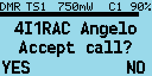

With the callers Callsign and Name (or ID) displayed on the above this text on the display.

To Accept the call, and configure the radio to return the Private call back to the calling station, Press the **Green** menu key, for YES. Otherwise either press the **Red** menu key for No, or ignore the prompt and continue using the radio as normal.

If you accept the Private Call, the radio will be switched into Private Call mode, ready for transmission. The callers' ID or name is show e.g.

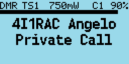

Once the private call is complete, you can return to the Talkgroup you were on prior to accepting the Private Call, by pressing **Function + Red** menu key. (or by any of the methods described in the section on making a Private Call)

## Hotspot mode

The OpenGD77 firmware can operate as a DMR (*voice only*) hotspot when connected via its USB programming cable to a Raspberry Pi running PiStar or any other device that is running MMDVMHost.

*Note.* Hotspot mode may be compatible with software like BlueDV, but your mileage may vary.

First, connect the GD-77 to a Raspberry Pi via its programming cable.

Hotspot mode works with the Raspberry Pi Zero, but a adaptor cable is needed to convert from the micro USB port on the RPi Zero to the full size USB plug on the GD-77 programming cable.

In the PiStar Configuration screen, select “OpenGD77 DMR hotspot (USB)” as the modem type.

If your version of PiStar does not contain the OpenGD77 DMR Hotspot as an option, please update your version of PiStar.

After connecting the radio to the raspberry pi, hold down the black side key while powering on the GD77. Assuming the modem type has been set properly in PiStar, the display will change on the GD-77 to show it is in Hotspot Mode, and will show the Colour Code, Receive frequency and approximate TX power in mW.

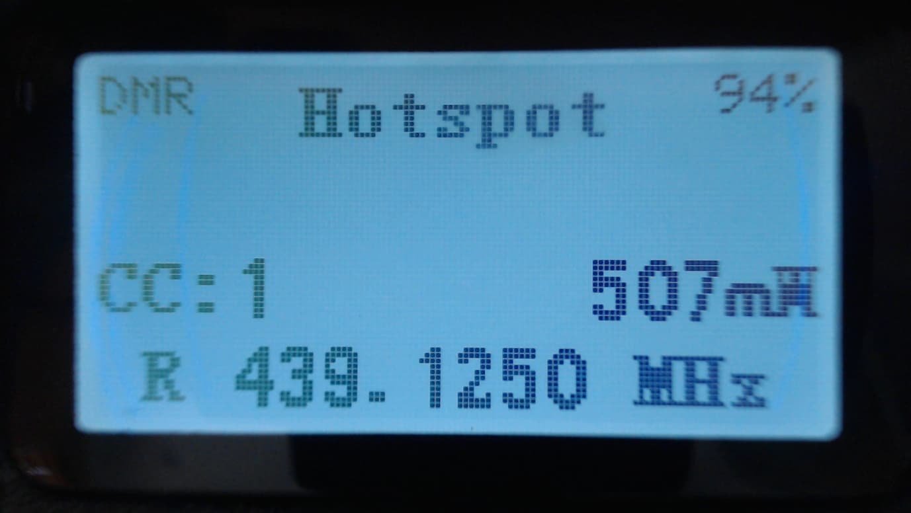

If the GD-77 does not enter Hotspot mode, power cycle the GD-77 and power cycle PiStar

If the GD-77 still fails to enter hotspot mode, check your USB connections.

*Note.* By default PiStar configures the “modem” to have a power setting of “100” in the Expert -> MMDVMHost settings.

This is 100% of the maximum power of the modem, and in the case of the GD-77 the maximum power output is 5W, but the radio is not designed to operate as a hotspot, where it may be continuously transmitting.

The maximum power setting that the GD-77 can support for continuous transmission will vary depending on the operating environment, including the ambient temperature and antenna SWR, etc.

It is the responsibility of the user to set an appropriate power level that will not overheat and damage the PA.

In Hotspot mode, if PiStar (MMDVMHost) sends a power setting of 100% it, the assumption is that that PiStar has not been correctly configured for the OpenGD77 and this value is disregarded.

Instead the firmware will use the power setting specified by the user in the Utilities menu, which will default to 1W.

If the power setting in the PiStar MMDVMHost Expert settings is any other value e.g. 50%, the hotspot will use that power value e.g. 2.5W (2500mW)

The receive frequency specified by PiStar will be displayed at the bottom of the screen.

*Note.* Offsets should not be applied to the TX or RX frequencies in PiStar, because the GD-77 should not need any offsets, and any offset will be reflected in the frequency displayed on the GD-77, because PiStar actually sends the master frequency +/- the offset to the hotspot.

When the GD-77 receives a RF DMR signal, the green LED on the top of the GD-77 will illuminate as normal, and the name and callsign are displayed if the DMR ID database contains that ID. If the ID is not in the DMR ID database, the ID number will be shown.

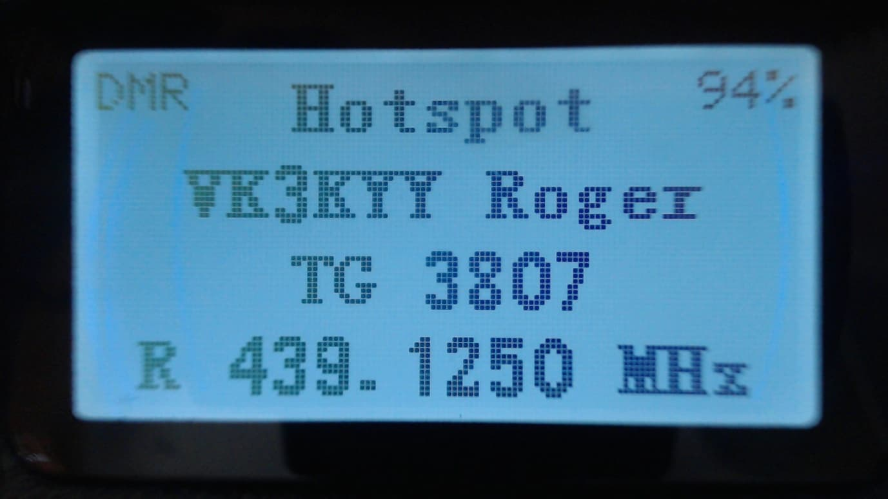

When PiStar receives traffic from the Internet and sends it to the hotspot for transmission, the hotspot displays the Callsign and name or the DMR ID, and the TX frequency is show.

The LED on the top of the radio also turns red to indicate the radio is transmitting

## Programming Channels and Talkgroups for use with OpenGD77

**NOTE**: You cannot use the standard Radioddity CPS to write to a GD-77 flashed with the OpenGD77 firmware. If you wish to use the Radioddity CPS the radio will need to run the official Radioddity firmware. Once the codeplug has been written to the GD-77 with your ID and callsign, you can then flash the OpenGD77 firmware to the radio and it will then read and operate with the code plug written to it with the standard firmware and CPS software.

As an alternative to the Radioddity CPS you can use the latest version of the “Community CPS” by Roger Clark that includes support for OpenGD77. Community CPS supports both the official GD77 firmware and OpenGD77.

Please download the latest GD77 Community CPS from here:
<https://github.com/rogerclarkmelbourne/radioddity_gd-77_cps/raw/master/installer/RadioddityGD77CPS31XCommunityEditionInstaller.exe>

Another alternative is to use the OpenGD77 CPS, which has functionalities specificially designed for OpenGD77. Some highlights include:

* 80 channels per zone
* "TG lists" instead of "Rx lists" to define TalkGroups assigned per channel for Left-Right scrolling
* Screengrab tool for taking screenshots from the radio's display

Please download the latest OpenGD77 CPS from here:
<https://github.com/rogerclarkmelbourne/radioddity_gd-77_cps/raw/master/installer/OpenGD77CPSInstaller.exe>

Please see the next section for information specific to the Community CPS and OpenGD77 CPS. The information in the rest of this section is applicable to both the standard Radioddity CPS and the Community CPS.

### Overview

OpenGD77 simplifies the concept of TalkGroups, for maximum convenience for radio amateurs. Unlike most commercial DMR radios it is not necessary to create multiple channels to use the same frequency with many different transmit TalkGroups. Changing is as simple as scrolling **Left** and **Right** across your TalkGroup list or entering an *ad hoc* TalkGroup by pressing the **hash** key.

In DMR mode when using either the VFO or the Zones and Channels, you can use the LEFT/RIGHT arrow keys to scroll through and select any of the TalkGroups in the Rx Group list assigned to the current channel, or to VFO A.

When programming the radio using the CPS first add all the TalkGroups that you think you may wish to use into the Digital Contacts list.

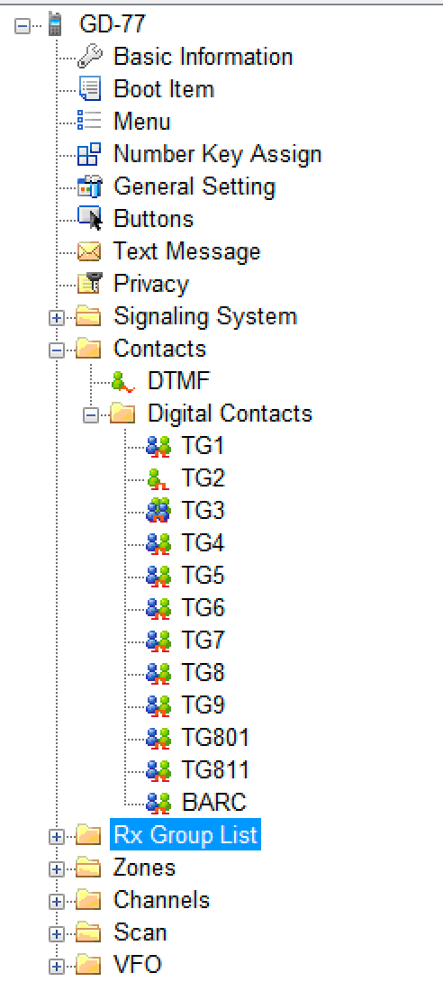

Next create one or more “TG Lists” and populate each with the sets of the Talkgroups that you will want to use with different channels. You can have the same Talkgroups in many TG Lists.

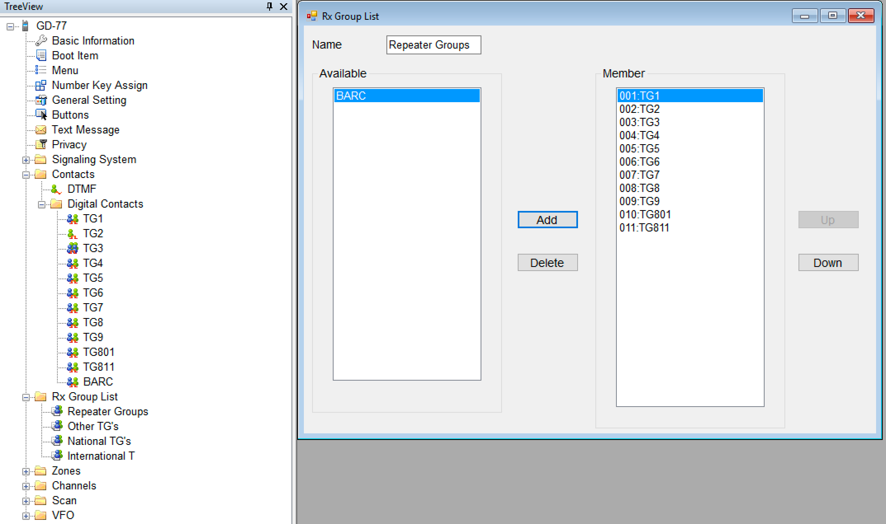

Now setup the channels. Enter the frequencies, slot and colour code as normal for a DMR channel.

Note. Currently the OpenGD77 firmware does not use the “Contact” e.g., shown as TG9 below. Instead it uses the TG’s in the TG list.
However we advise all users to set the “Contact” to the first channel in the TG list assigned to the channel.

Next select the TG List that you wish to use for the channel.

The OpenGD77 firmware can use the TG list to filter the incoming DMR signal, or it can operate in “Digital Monitor Mode” (aka promiscuous mode) all the time. This can be set in the radio quick menu setting for **Filter**.

*Note.* The “Contact” is not used by the OpenGD77 firmware. You must use the TG list to define the TG’s you want to use with each channel. Hence you must have at least 1 TG list and it must contain at least 1 Digital Contact which is a TalkGroup.

Finally save your codeplug to your computer before writing the code plug to the radio using either the standard Radioddity CPS to programme the radio before flashing it to OpenGD77 or if you are using the special OpenGD77 compatible version of the “Community CPS”, (as detailed in the next section) you can write the code plug directly to an already flashed OpenGD77 radio.

#### New Driver Installation

The CPS installer now also installs the OpenGD77 comm port driver, however the comm port driver can be installed manually by downloading the files from
<https://github.com/rogerclarkmelbourne/OpenGD77/tree/master/OpenGD77CommDriver>

To install the driver, download and unzip the zip file, and run the .bat file

Once the driver is installed, the Windows device manager should show the “OpenGD77” in the “ports” section of the Windows device manager

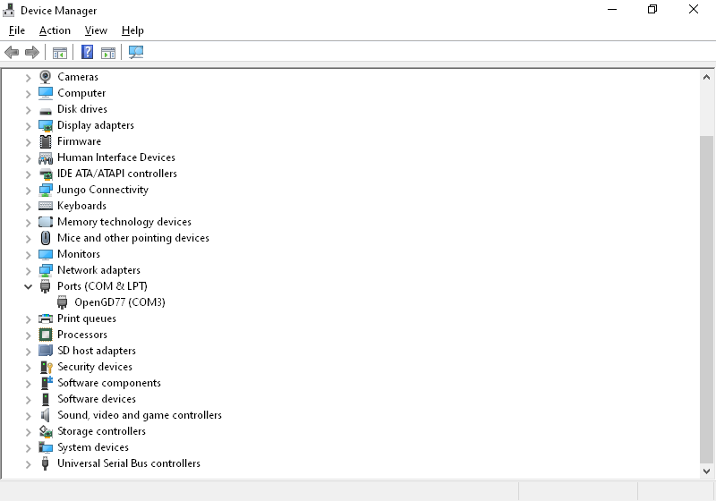

#### OpenGD77 Menu

In the CPS there is a new menu item under the Extras menu for OpenGD77 Support, which opens this window.

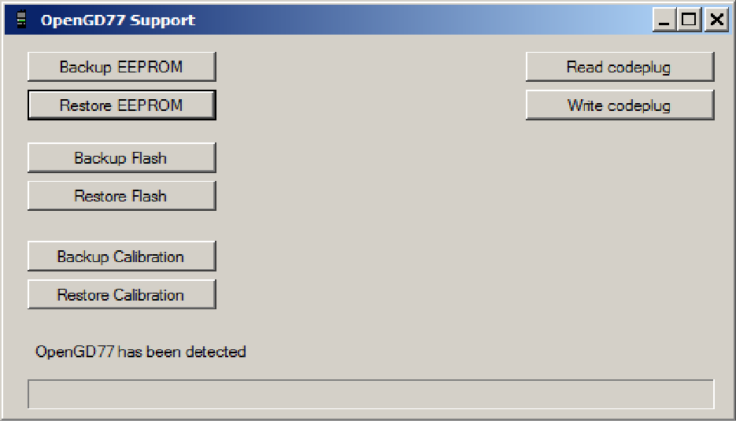

From here you can backup, the internal 64k EEPOM and the 1 mega byte Flash chip, as well as Reading and Writing the codeplug.
The calibration data store in the Flash chip (At address 0x8f000) can be backed up and restored without backing up the whole of the Flash.

*Note.* If you restore the Flash you will also overwrite the calibration data as it’s stored in the 1Mb Flash chip.

You can also use this window to grab a screenshot from the phone's current display. Screenshots are saved in PNG format.

#### Backup Before You Do Anything Else

Before writing a codeplug to the radio, you should backup both the EEPROM and Flash chip, and save the files somewhere safe, in case something goes wrong in the future and you need to restore the data.

#### Reading and Writing Your Codeplug

To read the codeplug, press the “Read codeplug” button, wait for all 3 data sections to download, and then close the OpenGD77 Support window. To write a codeplug press the “Write codeplug” button.

#### Writing DMR IDs -- the User Database

The OpenGD77 supports extended DMR ID information, with up to 15 character for Callsign and name, as well as doubling the memory capacity for DMR IDs.

Please select the “Enhanced firmware mode” Checkbox, and change the Number of characters menu to the desired DMR callsign and name length.

Then, you can add in DMR IDs into the database by selecting an ID prefix. You can continue adding DMR IDs based on your commonly heard prefixes until you fill up the allocation.

*Note.* Because the memory size used for the DMR ID is currently limited to 256, you can store more DMR IDs if you assign fewer characters per ID. Depending on actual information, OpenGD77 can store approximately 14,000-15,000 IDs in its user database.

As OpenGD77 supports Talker Alias, you might find this sufficient -- OpenGD77 will display callsign and name data retrieved from the DMR stream, for user IDs not stored in your radio's User Database.

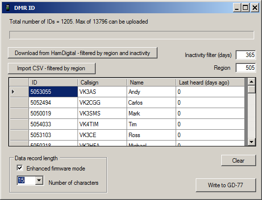
